## 数据类型

#### 数据类型优缺点

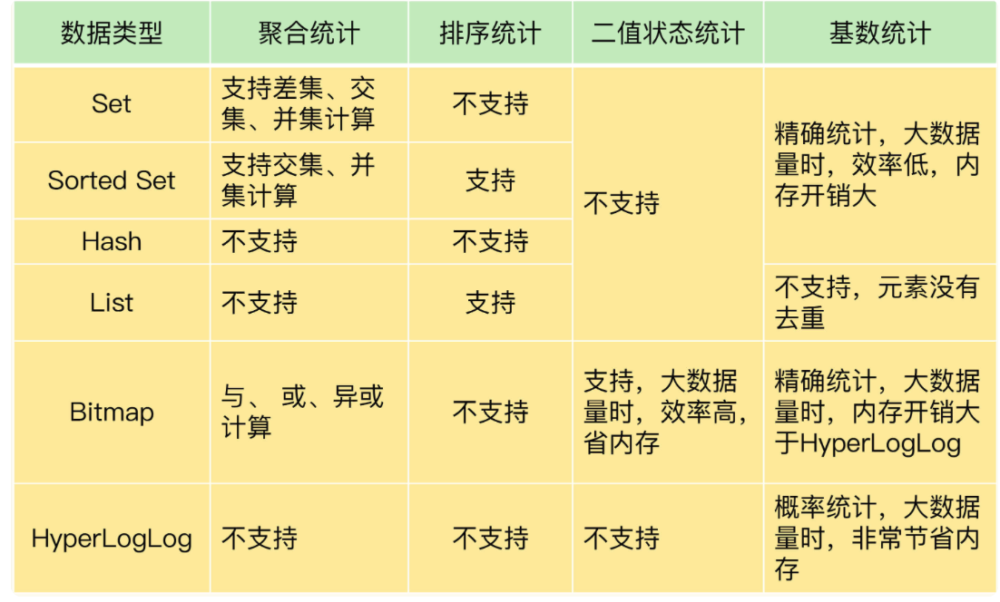

#### 简单动态字符串

```
//value的总长度：len+free+1
struct sdshdr {

    // 记录 buf 数组中已使用字节的数量
    // 等于 SDS 所保存字符串的长度(实际字符串)
    int len;

    // 记录 buf 数组中未使用字节的数量
    int free;

    // 字节数组，用于保存字符串
    char buf[];
};
```

防止缓存溢出、泄漏、内存重分配等问题，SDS实现 **空间预分配和惰性空** 间释放优化策略。

**空间预分配：** 主要用来优化SDS字符串增长，在给SDS扩展时，对SDS除分配所必要空间大小外，还会给SDS分配额外空间，额外空间具体：如果SDS小于1MB，那么Free就是len的大小，如果SDS大于1MB，则free则会多分配1MB。

**惰性空间优化：** 主要用来优化缩短操作，在给SDS缩短操作时，序并不立即使用内存重分配来回收缩短后多出来的字节， 而是使用 free 属性将这些字节的数量记录起来， 并等待将来使用


#### 链表

```
//节点
typedef struct listNode {
    // 前置节点
    struct listNode *prev;
    // 后置节点
    struct listNode *next;
    // 节点的值
    void *value;
} listNode;

//链表
typedef struct list {
    // 表头节点
    listNode *head;
    // 表尾节点
    listNode *tail;
    // 链表所包含的节点数量
    unsigned long len;
    // 节点值复制函数
    //dup 函数用于复制链表节点所保存的值；
    void *(*dup)(void *ptr);
    // 节点值释放函数
    //free 函数用于释放链表节点所保存的值；
    void (*free)(void *ptr);
    // 节点值对比函数
    //match 函数则用于对比链表节点所保存的值和另一个输入值是否相等。
    int (*match)(void *ptr， void *key);
} list;
```

- 链表被广泛用于实现 Redis 的各种功能， 比如列表键， 发布与订阅， 慢查询， 监视器， 等等
- 每个链表节点由一个 listNode 结构来表示， 每个节点都有一个指向前置节点和后置节点的指针， 所以 Redis 的链表实现是**双端链表**
- 每个链表使用一个 **list 结构** 来表示， 这个结构带有表头节点指针、表尾节点指针、以及链表长度等信息
- 因为链表表头节点的前置节点和表尾节点的后置节点都指向 NULL ， 所以 Redis 的链表实现是**无环链表**
- 通过为链表设置不同的类型特定函数， Redis 的链表可以用于保存各种不同类型的值


#### 字典

```
//字典
typedef struct dict {

    // 类型特定函数
    //type 属性是一个指向 dictType 结构的指针， 每个 dictType 结构保存了一簇用于操作特定类型键值对的函数， Redis 会为用途不同的字典设置不同的类型特定函数
    dictType *type;

    // 私有数据
    //privdata 属性则保存了需要传给那些类型特定函数的可选参数
    void *privdata;

    // 哈希表
    //ht 属性是一个包含两个项的数组， 数组中的每个项都是一个 dictht 哈希表， 一般情况下， 字典只使用 ht[0] 哈希表， ht[1] 哈希表只会在对 ht[0] 哈希表进行 rehash 时使用
    dictht ht[2];

    // rehash 索引
    // 当 rehash 不在进行时，值为 -1，记录了rehash目前的进度
    int rehashidx; /* rehashing not in progress if rehashidx == -1 */
    //rehash 有关的属性就是 rehashidx ： 它记录了 rehash 目前的进度， 如果目前没有在进行 rehash ， 那么它的值为 -1

} dict;

//dictType 字典结构体中属性
typedef struct dictType {

    // 计算哈希值的函数
    unsigned int (*hashFunction)(const void *key);

    // 复制键的函数
    void *(*keyDup)(void *privdata， const void *key);

    // 复制值的函数
    void *(*valDup)(void *privdata， const void *obj);

    // 对比键的函数
    int (*keyCompare)(void *privdata， const void *key1， const void *key2);

    // 销毁键的函数
    void (*keyDestructor)(void *privdata， void *key);

    // 销毁值的函数
    void (*valDestructor)(void *privdata， void *obj);

} dictType;


//哈希表，它是实现字典的底层结构
typedef struct dictht {

    // 哈希表数组，每个table指向dictEntry的指针
    //dictEntry table 默认是4，可以通过修改源码调整
    dictEntry **table;

    // 哈希表大小
    unsigned long size;

    // 哈希表大小掩码，用于计算索引值
    // 总是等于 size - 1
    unsigned long sizemask;

    // 该哈希表已有节点的数量(注意是节点)
    unsigned long used;

} dictht;

//哈希表节点，每个节点保存一个键值队
typedef struct dictEntry {
    // 键
    void *key;
    // 值
    //键值对的值可以是一个指针， 或者是一个 uint64_t 整数， 又或者是一个 int64_t 整数
    union {
        void *val;
        uint64_t u64;
        int64_t s64;
    } v;

    // 指向下个哈希表节点，形成链表
    //有多个hash键分配到同一个索引位置，dictEntry节点的next组成单链表连接起来，解决hash冲突
    struct dictEntry *next;

} dictEntry;
```


#### 跳跃表

```
//节点
typedef struct zskiplistNode {

    // 后退指针
    struct zskiplistNode *backward;

    // 分值
    double score;

    // 成员对象
    robj *obj;

    // 层
    struct zskiplistLevel {

        // 前进指针
        struct zskiplistNode *forward;

        // 跨度
        unsigned int span;

    } level[];

} zskiplistNode;

//连接节点
typedef struct zskiplist {

    // 表头节点和表尾节点
    struct zskiplistNode *header， *tail;

    // 表中节点的数量
    unsigned long length;

    // 表中层数最大的节点的层数
    int level;

} zskiplist;
```

- Redis **有序集合**在节点元素较大或者元素数量较多时使用跳跃表实现
- 跳跃表基于单链表加索引的方式实现

#### 整数集合

```
typedef struct intset {

    // 编码方式
    uint32_t encoding;

    // 集合包含的元素数量
    uint32_t length;

    // 保存元素的数组
    int8_t contents[];

} intset;
```

- 集合的实现，一个集合只包含整数且元素数量不多时使用改类型

#### 压缩列表


###### 节点

> 1. 节点的 `previous_entry_length` 属性以字节为单位， 记录了压缩列表中前一个节点的长度。
>
> `previous_entry_length` 属性的长度可以是 `1` 字节或者 `5` 字节：
>
> - 如果前一节点的长度小于 `254` 字节， 那么 `previous_entry_length` 属性的长度为 `1` 字节： 前一节点的长度就保存在这一个字节里面。
> - 如果前一节点的长度大于等于 `254` 字节， 那么 `previous_entry_length` 属性的长度为 `5` 字节： 其中属性的第一字节会被设置为 `0xFE` （十进制值 `254`）， 而之后的四个字节则用于保存前一节点的长度。
>
> 2. 节点的 `encoding` 属性记录了节点的 `content` 属性所保存数据的类型以及长度
>
> 3. 节点的 `content` 属性负责保存节点的值， 节点值可以是一个字节数组或者整数， 值的类型和长度由节点的 `encoding` 属性决定。

- **hash或列表** 的实现
- 当列表(或hash)包含少量列表，并且每个列表(hash键值对)是小整数值或短字符串时，使用压缩列表

#### 对象redisObject

```
typedef struct redisObject {
    // 类型
    unsigned type:4;

    //对象的 ptr 指针指向对象的底层实现数据结构， 而这些数据结构由对象的 encoding 属性决定。
    //encoding 属性记录了对象所使用的编码， 也即是说这个对象使用了什么数据结构作为对象的底层实现， 这个属性的值可以是表 8-3 列出的常量的其中一个。
    unsigned encoding:4;
    
    // 指向底层实现数据结构的指针
    void *ptr;
    // ...

} robj;

type 类型值

对象			对象type属性的值	TYPE 命令的输出
字符串对象	REDIS_STRING	"string"
列表对象	REDIS_LIST	"list"
哈希对象	REDIS_HASH	"hash"
集合对象	REDIS_SET	"set"
有序集合对象	REDIS_ZSET	"zset"

encoding编码
编码常量	编码所对应的底层数据结构
REDIS_ENCODING_INT	long 类型的整数
REDIS_ENCODING_EMBSTR	embstr 编码的简单动态字符串
REDIS_ENCODING_RAW	简单动态字符串
REDIS_ENCODING_HT	字典
REDIS_ENCODING_LINKEDLIST	双端链表
REDIS_ENCODING_ZIPLIST	压缩列表
REDIS_ENCODING_INTSET	整数集合
REDIS_ENCODING_SKIPLIST	跳跃表和字典

//查看key的编码
object encoding key
```


> 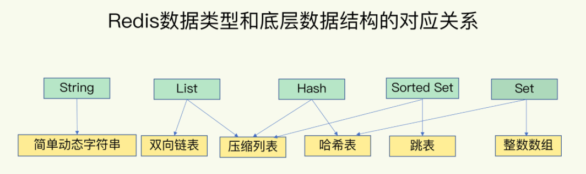
>
> - **字符串对象**
>
>     1 如果值可以用long类型表示，则为 int
>
>     2 字符串值的长度大于 `44` 字节，专门用于保存短字符串的一种优化编码方式
>
>     3 其它使用raw，如果对int、embstr追加字符串，则会直接转换为raw编码
>
> - **列表对象(ziplist linkedlist)**
>
>     1 `ziplist` 编码必须满足两个条件：列表对象保存的所有字符串元素的长度都小于 `64` 字节和列表对象保存的元素数量小于 `512` 个
>
>     2 不满足1的条件则使用linkedlist双端链表
>
>     ```
>     以上两个条件的上限值是可以修改的， 具体请看配置文件中关于 list-max-ziplist-value 选项和 list-max-ziplist-entries 选项的说明。
>     ```
>
> - **哈希对象(ziplist(节省内存 速度慢) hashtable(速度快 耗内存))**
>
>     满足如下两个条件，则转换为ziplist编码：
>
>     1 哈希对象保存的所有键值对的键和值的字符串长度都小于 `64` 字节
>
>     2 哈希对象保存的键值对数量小于 `512` 个
>
>     ```
>      hash-max-ziplist-value 选项和 hash-max-ziplist-entries 
>     ```
>
> - **集合对象(intset hashtable)**
>
>     满足条件情况，使用intset编码:
>
>     1 集合对象保存的所有元素都是整数值
>
>     2 集合对象保存的元素数量不超过 `512` 个
>
>     ```
>     set-max-intset-entries 
>     ```
>
> - **有序集合(ziplist skiplist)**
>
>     满足条件情况，使用ziplist编码:
>
>     1 有序集合保存的元素数量小于 `128` 个
>
>     2 有序集合保存的所有元素成员的长度都小于 `64` 字节

## redis重点

#### 渐进式rehash

> redis默认使用了两个全局哈希表，h1和h2，正常情况h1插入数据，h2不使用。随着h1数据增多，redis开始执行rehash操作：
>
> 1. 给h2分配更大的空间，例如是当前h1的两倍
> 2. redis正常处理客户端请求，每处理一个请求就从h1中的第一个索引开始，把这个索引位置上的哈希桶拷贝到h2中，等下一次再处理时，再拷贝h1的下一个索引位置哈希桶。(主要逻辑：把h1中的数据重新**映射并且拷贝**到h2中)
> 3. 释放h1空间
>
> 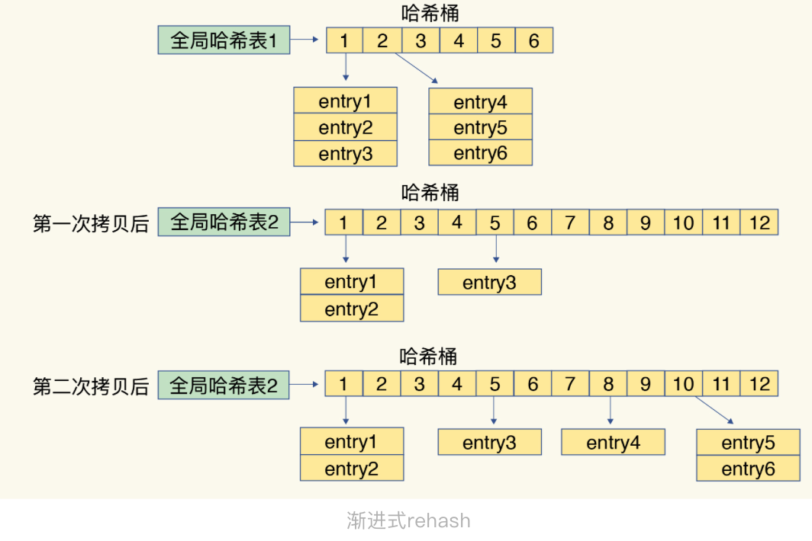

#### Redis高性能的几个原因

- redis大部分操作在内存完成
- 高效的数据结构(跳表、hash)
- 多路复用,使其在网络 IO 操作中能并发处理大量的客户端请求，实现高吞吐率

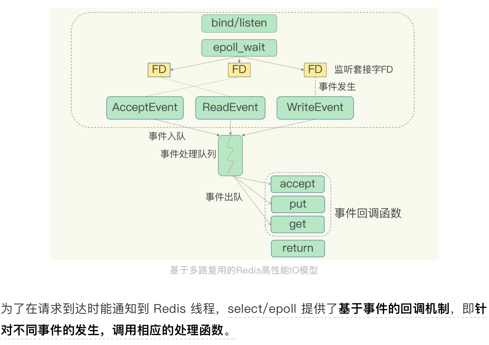

## redis持久化

#### AOF

- 特点

>  1. 先写命令，再记录日志，aof日志生成时为了性能考虑，不会检查命令对错，如果先记录log,有可能出现命令错误的情况
>
>  2. 记录redis的每一条命令
>
>  3. aof是在主线程记录写操作的日志(注意写入内存和日志缓存是一个线程，只是到日志缓冲区到磁盘这一步可以是，每次刷新，定时1秒刷新，文件系统刷新)。
>
>     **写会策略:** **Always**，同步写回：每个写命令执行完，立马同步地将日志写回磁盘；**Everysec**，每秒写回：每个写命令执行完，只是先把日志写到 AOF 文件的内存缓冲区，每隔一秒把缓冲区中的内容写入磁盘；**No**，操作系统控制的写回：每个写命令执行完，只是先把日志写到 AOF 文件的内存缓冲区，由操作系统决定何时将缓冲区内容写回磁盘
>     
>  4. 主线程生成AOF日志

- 日志文件太大

> 性能问题： 系统本身对文件大小限制。文件太大再追加命令效率也会变低。发生宕机，aof文件故障恢复就会很慢
>
> aof重写机制：AOF的重写不是根据原有的AOF去做，而是根据当前内存数据库的数据，去生成一条条命令进行保存。和 AOF 日志由主线程写回不同，重写过程是由后台子进程 bgrewriteaof 来完成的(执行重写时，主线程fork出bgrewriteaof的线程，并且fork会把主线程的内存拷贝一份给到bgrewriteaof)。
>
> 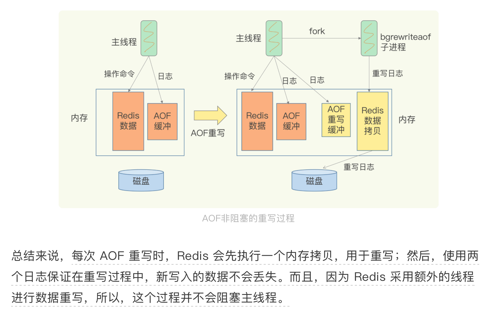

#### RDB

- 特点

> 1. 生成RDB文件两个命令：save和bgsave。save在主线程中执行，会导致阻塞，bgsave：创建一个子进程，专门用于写入 RDB 文件，避免了主线程的阻塞，这也是 Redis RDB 文件生成的默认配置
> 2. fork 这个操作会阻塞主线程

- RDB写时复制（Copy-On-Write, COW），在执行快照的同时，正常处理写操作

> redis生成RDB时fork出子进程，此时读：主线程和bgsave子线程互不影响，写：被修改的数据会被复制一份当做副本，bgsave子进程继续把原值写入RDB,主线程修改副本值（*这个操作在实际执行过程中，是子进程复制了主线程的页表，所以通过页表映射，能读到主线程的原始数据，而当有新数据写入或数据修改时，主线程会把新数据或修改后的数据写到一个新的物理内存地址上，并修改主线程自己的页表映射。所以，子进程读到的类似于原始数据的一个副本，而主线程也可以正常进行修改*）
>
> 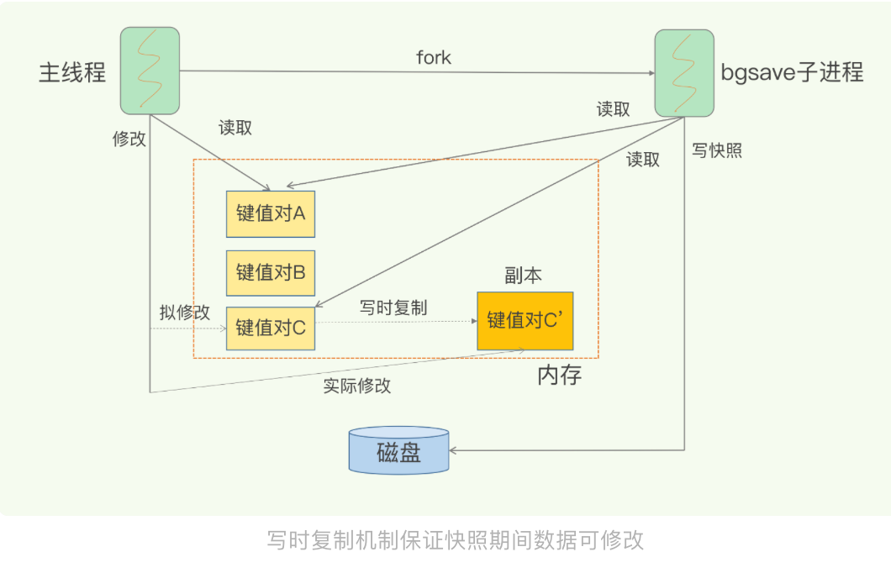

## 集群

#### 主从

- 详解

> 读操作：主库、从库都可以接收
> 写操作：首先到主库执行，然后，主库将写操作同步给从库

- 主从同步

> 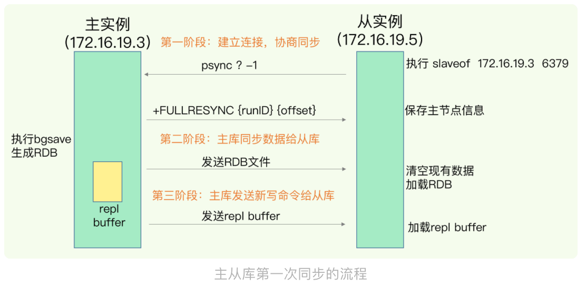
>
> 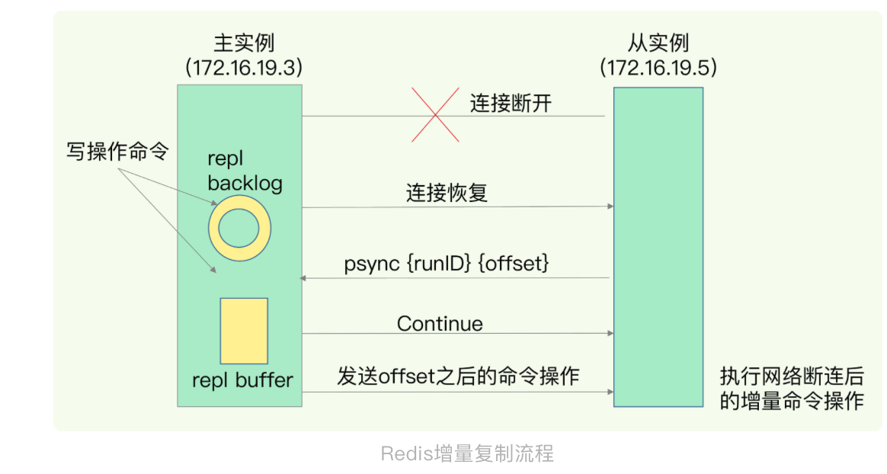
>
> FULLRESYNC 响应表示第一次复制采用的全量复制，也就是说，主库会把当前所有的数据都复制给从库。

#### 哨兵

- 定义

> 哨兵主要负责的就是三个任务：监控、选主（选择主库）和通知
>
> 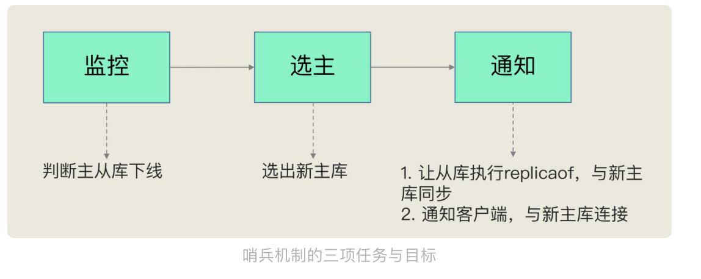
>
> 哨兵是通过心跳检测，监控主库状态
>
> 哨兵监控是可能误判的，所以哨兵一般是集群部署，采取投票的形式减少误判
>
> 选定新主库规则是先筛选在打分，得分高的会被选为新主库
>
> 筛选规则：从库当前的网络连接状况，以及之前的网络连接状况，筛选中断次数标准可以配置

## redis性能

#### 产生性能问题情况

- 删除包含大量元素的集合，即bigkey
- 使用复杂度(O(N))高的函数操作，例如hgetall、smembers以及聚合计算(交集、并集等)
- 清空redis(flushall/flushdb)
- AOF 日志同步写
- 主从交互时，从同步主过来的rdb文件，需要先清空本地数据(flushall),然后同步rdb文件，rdb文件越大加载越慢

#### 分析、排查、解决Redis变慢问题

> 1、使用复杂度过高的命令（例如SORT/SUION/ZUNIONSTORE/KEYS），或一次查询全量数据（例如LRANGE key 0 N，但N很大）
>
> 分析：a) 查看slowlog是否存在这些命令 b) Redis进程CPU使用率是否飙升（聚合运算命令导致）
>
> 解决：a) 不使用复杂度过高的命令，或用其他方式代替实现（放在客户端做） b) 数据尽量分批查询（LRANGE key 0 N，建议N<=100，查询全量数据建议使用HSCAN/SSCAN/ZSCAN）
>
> 2、操作bigkey
>
> 分析：a) slowlog出现很多SET/DELETE变慢命令（bigkey分配内存和释放内存变慢） b) 使用redis-cli -h $host -p $port --bigkeys扫描出很多bigkey
>
> 解决：a) 优化业务，避免存储bigkey b) Redis 4.0+可开启lazy-free机制
>
> 3、大量key集中过期
>
> 分析：a) 业务使用EXPIREAT/PEXPIREAT命令 b) Redis info中的expired_keys指标短期突增
>
> 解决：a) 优化业务，过期增加随机时间，把时间打散，减轻删除过期key的压力 b) 运维层面，监控expired_keys指标，有短期突增及时报警排查
>
> 4、Redis内存达到maxmemory
>
> 分析：a) 实例内存达到maxmemory，且写入量大，淘汰key压力变大 b) Redis info中的evicted_keys指标短期突增
>
> 解决：a) 业务层面，根据情况调整淘汰策略（随机比LRU快） b) 运维层面，监控evicted_keys指标，有短期突增及时报警 c) 集群扩容，多个实例减轻淘汰key的压力
>
> 5、大量短连接请求
>
> 分析：Redis处理大量短连接请求，TCP三次握手和四次挥手也会增加耗时
>
> 解决：使用长连接操作Redis
>
> 6、生成RDB和AOF重写fork耗时严重
>
> 分析：a) Redis变慢只发生在生成RDB和AOF重写期间 b) 实例占用内存越大，fork拷贝内存页表越久 c) Redis info中latest_fork_usec耗时变长
>
> 解决：a) 实例尽量小 b) Redis尽量部署在物理机上 c) 优化备份策略（例如低峰期备份） d) 合理配置repl-backlog和slave client-output-buffer-limit，避免主从全量同步 e) 视情况考虑关闭AOF f) 监控latest_fork_usec耗时是否变长
>
> 7、AOF使用awalys机制
>
> 分析：磁盘IO负载变高
>
> 解决：a) 使用everysec机制 b) 丢失数据不敏感的业务不开启AOF
>
> 8、使用Swap
>
> 分析：a) 所有请求全部开始变慢 b) slowlog大量慢日志 c) 查看Redis进程是否使用到了Swap
>
> 解决：a) 增加机器内存 b) 集群扩容 c) Swap使用时监控报警
>
> 9、进程绑定CPU不合理
>
> 分析：a) Redis进程只绑定一个CPU逻辑核 b) NUMA架构下，网络中断处理程序和Redis进程没有绑定在同一个Socket下
>
> 解决：a) Redis进程绑定多个CPU逻辑核 b) 网络中断处理程序和Redis进程绑定在同一个Socket下
>
> 10、开启透明大页机制
>
> 分析：生成RDB和AOF重写期间，主线程处理写请求耗时变长（拷贝内存副本耗时变长）
>
> 解决：关闭透明大页机制
>
> 11、网卡负载过高
>
> 分析：a) TCP/IP层延迟变大，丢包重传变多 b) 是否存在流量过大的实例占满带宽
>
> 解决：a) 机器网络资源监控，负载过高及时报警 b) 提前规划部署策略，访问量大的实例隔离部署
>
> 总之，Redis的性能与CPU、内存、网络、磁盘都息息相关，任何一处发生问题，都会影响到Redis的性能。

## redis淘汰策略

> 在设置了过期时间的数据中进行淘汰，包括 volatile-random、volatile-ttl、volatile-lru、volatile-lfu（Redis 4.0 后新增）四种
>
> 在所有数据范围内进行淘汰，包括 allkeys-lru、allkeys-random、allkeys-lfu（Redis 4.0 后新增）三种

> volatile-ttl 在筛选时，会针对设置了过期时间的键值对，根据过期时间的先后进行删除，越早过期的越先被删除
>
> volatile-random 就像它的名称一样，在设置了过期时间的键值对中，进行随机删除
>
> volatile-lru 会使用 LRU 算法筛选设置了过期时间的键值对
>
> volatile-lfu 会使用 LFU 算法选择设置了过期时间的键值对

> allkeys-random 策略，从所有键值对中随机选择并删除数据
>
> allkeys-lru 策略，使用 LRU 算法在所有数据中进行筛选
>
> allkeys-lfu 策略，使用 LFU 算法在所有数据中进行筛选

- lru策略

> Redis 在决定淘汰的数据时，第一次会随机选出 N(是可以配置的) 个数据，把它们作为一个候选集合。接下来，Redis 会比较这 N 个数据的 lru 字段，把 lru 字段值最小的数据从缓存中淘汰出去

- 淘汰策略建议

> 1. 优先使用 allkeys-lru 策略。这样，可以充分利用 LRU 这一经典缓存算法的优势，把最近最常访问的数据留在缓存中，提升应用的访问性能。如果你的业务数据中有明显的冷热数据区分，我建议你使用 allkeys-lru 策略
> 2. 如果业务应用中的数据访问频率相差不大，没有明显的冷热数据区分，建议使用 allkeys-random 策略，随机选择淘汰的数据就行
> 3. 如果你的业务中有置顶的需求，比如置顶新闻、置顶视频，那么，可以使用 volatile-lru 策略，同时不给这些置顶数据设置过期时间。这样一来，这些需要置顶的数据一直不会被删除，而其他数据会在过期时根据 LRU 规则进行筛选

## 缓存一致性

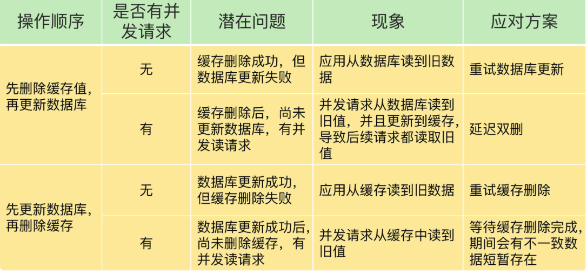

#### 问题

> 在缓存和db正常修改时，即使两个操作都成功，在有大量并发时也可能导致读到不一致的情况

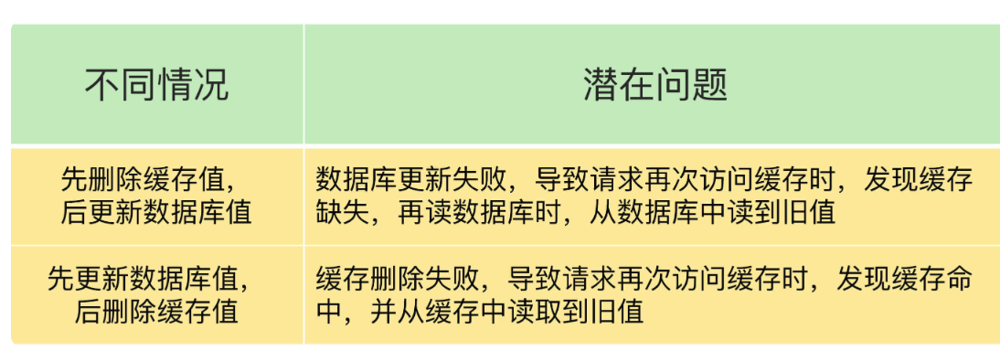

- 先删缓存，再更新db

> A删除了缓存，还没更新db,B请求过来，发现缓存缺失，从db中得到旧值，回填到redis中，缓存中就一直是旧值

- 先更新db,再删缓存

> 如果线程 A 删除了数据库中的值，但还没来得及删除缓存值，线程 B 就开始读取数据了，那么此时，线程 B 查询缓存时，发现缓存命中，就会直接从缓存中读取旧值。不过，在这种情况下，如果其他线程并发读缓存的请求不多，那么，就不会有很多请求读取到旧值。而且，线程 A 一般也会很快删除缓存值，这样一来，其他线程再次读取时，就会发生缓存缺失，进而从数据库中读取最新值。所以，**这种情况对业务的影响较小**

#### 解决

- 先删缓存，再更新db的解决方案

> 在线程 A 更新完数据库值以后，我们可以让它先 sleep 一小段时间，再进行一次缓存删除操作(即删除B请求回填的旧值)，（**延迟双删**）
>
> 之所以要加上 sleep 的这段时间，就是为了让线程 B 能够先从数据库读取数据，再把缺失的数据写入缓存，然后，线程 A 再进行删除。所以，线程 A sleep 的时间，就需要大于线程 B 读取数据再写入缓存的时间。这个时间怎么确定呢？建议你在业务程序运行的时候，统计下线程读数据和写缓存的操作时间，以此为基础来进行估算

- 重试机制

> 可以把要删除的缓存值或者是要更新的数据库值暂存到消息队列中（例如使用 Kafka 消息队列）。当应用没有能够成功地删除缓存值或者是更新数据库值时，可以从消息队列中重新读取这些值，然后再次进行删除或更新
>
> 如果能够成功地删除或更新，我们就要把这些值从消息队列中去除，以免重复操作，此时，我们也可以保证数据库和缓存的数据一致了。否则的话，我们还需要再次进行重试。如果重试超过的一定次数，还是没有成功，我们就需要向业务层发送报错信息了


## Redis 缓存雪崩、击穿、穿透

#### 缓存雪崩

> 大量的key在同一时刻过期，同时大量request过来，全部打到DB上，造成系统宕机等问题

- 热点key永不过期
- 给热点key设置不同的过期时间，给过期时间一样的key，设置过期时间时，在给定范围内加一个随机值

#### 缓存穿透

> 缓存穿透是指DB和redis中都没有数据，客户不停的请求，然后全部打到DB上

- 参数校验，不合法直接retrun,nginx限制同一个ip每秒请求次数
- **布隆过滤器（Bloom Filter）**去判断，**如果key不存在，则一定不存在**，存在的不一定存在，有一定的误判

#### 缓存击穿

> 对某一个热点key请求，在key失效的瞬间，大量request过来全部打到DB

- key永不过期
- 互斥锁

## TIPS

- config set修改后，需要执行config rewrite才会更改redis.conf
- redis启动

```
redis-server & 后台进程启动
redis-server /etc/redis/6379.conf
```

- 大key操作风险

> 在集群模式使用多个key聚合计算的命令，一定要注意，因为这些key可能分布在不同的实例上，多个实例之间是无法做聚合运算的，这样操作可能会直接报错或者得到的结果是错误的
>
> 当数据量非常大时，使用这些统计命令，因为复杂度较高，可能会有阻塞Redis的风险，建议把这些统计数据与在线业务数据拆分开，实例单独部署，防止在做统计操作时影响到在线业务
>
> 使用SUNIONSTORE，SDIFFSTORE，SINTERSTOR做并集，差集，交集时，这三个命令都会在Redis中生成一个新key,而从库默认是readOnly。所以这些命令只能在主库上使用
>
> SUNION，SDIFF,SINTER，这些命令可以计算出结果，不产生新的key可以在从库使用

- 原子性

> 脚本中用redis.call函数时出错了，会导致执行中断，此时，Lua脚本是不会回滚的

## 工具

#### redis容量估计工具(不同类型保存时的内存开销)

> http://www.redis.cn/redis_memory/
