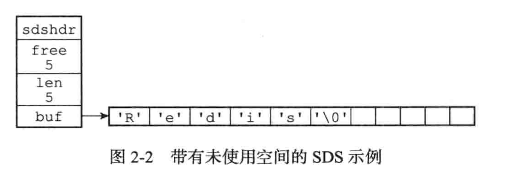
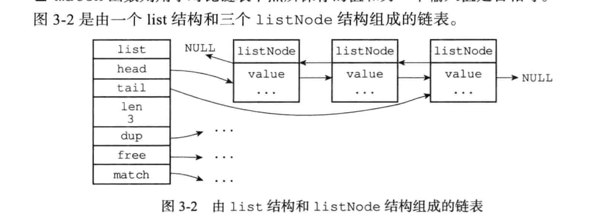
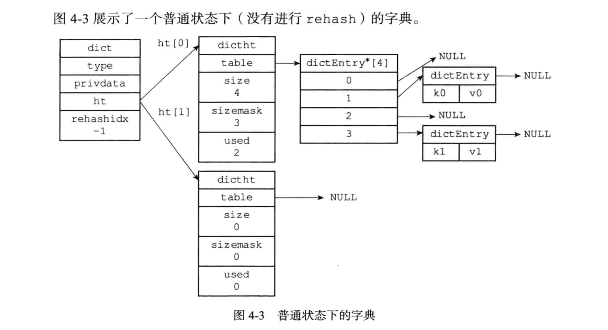
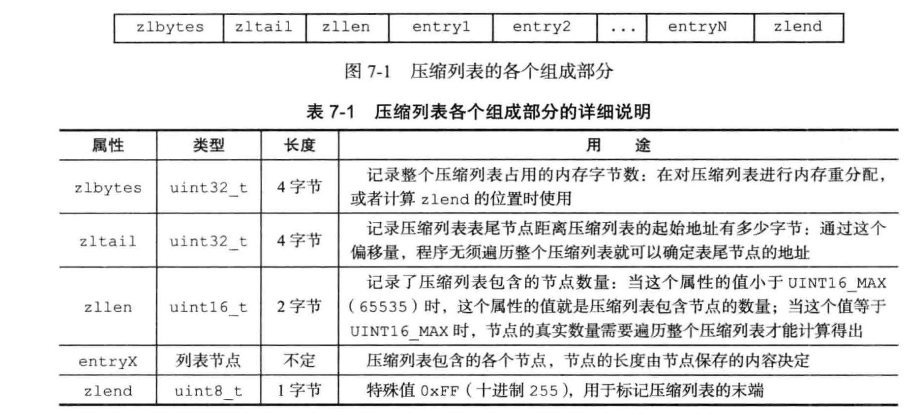
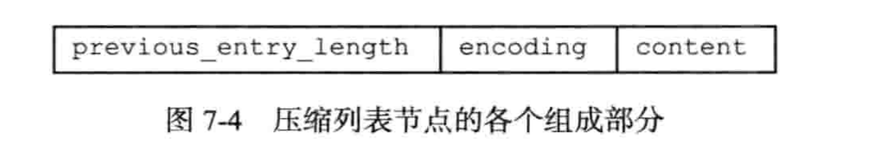
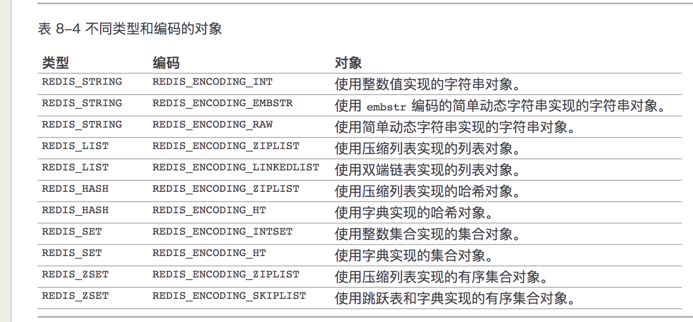
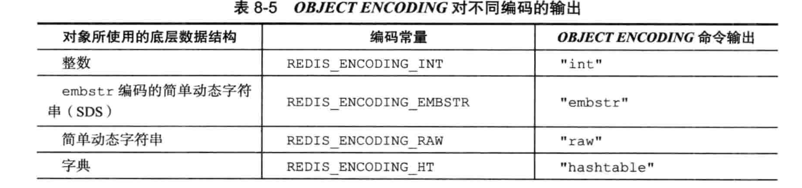
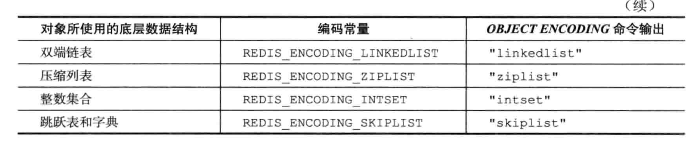

## 数据类型

#### 简单动态字符串

```
//value的总长度：len+free+1
struct sdshdr {

    // 记录 buf 数组中已使用字节的数量
    // 等于 SDS 所保存字符串的长度(实际字符串)
    int len;

    // 记录 buf 数组中未使用字节的数量
    int free;

    // 字节数组，用于保存字符串
    char buf[];
};
```

防止缓存溢出、泄漏、内存重分配等问题，SDS实现 **空间预分配和惰性空** 间释放优化策略。

**空间预分配：** 主要用来优化SDS字符串增长，在给SDS扩展时，对SDS除分配所必要空间大小外，还会给SDS分配额外空间，额外空间具体：如果SDS小于1MB,那么Free就是len的大小，如果SDS大于1MB,则free则会多分配1MB。

**惰性空间优化：** 主要用来优化缩短操作，在给SDS缩短操作时，序并不立即使用内存重分配来回收缩短后多出来的字节， 而是使用 free 属性将这些字节的数量记录起来， 并等待将来使用



#### 链表

```
//节点
typedef struct listNode {
    // 前置节点
    struct listNode *prev;
    // 后置节点
    struct listNode *next;
    // 节点的值
    void *value;
} listNode;

//链表
typedef struct list {
    // 表头节点
    listNode *head;
    // 表尾节点
    listNode *tail;
    // 链表所包含的节点数量
    unsigned long len;
    // 节点值复制函数
    //dup 函数用于复制链表节点所保存的值；
    void *(*dup)(void *ptr);
    // 节点值释放函数
    //free 函数用于释放链表节点所保存的值；
    void (*free)(void *ptr);
    // 节点值对比函数
    //match 函数则用于对比链表节点所保存的值和另一个输入值是否相等。
    int (*match)(void *ptr, void *key);
} list;
```

- 链表被广泛用于实现 Redis 的各种功能， 比如列表键， 发布与订阅， 慢查询， 监视器， 等等
- 每个链表节点由一个 listNode 结构来表示， 每个节点都有一个指向前置节点和后置节点的指针， 所以 Redis 的链表实现是**双端链表**
- 每个链表使用一个 **list 结构** 来表示， 这个结构带有表头节点指针、表尾节点指针、以及链表长度等信息
- 因为链表表头节点的前置节点和表尾节点的后置节点都指向 NULL ， 所以 Redis 的链表实现是**无环链表**
- 通过为链表设置不同的类型特定函数， Redis 的链表可以用于保存各种不同类型的值



#### 字典

```
//字典
typedef struct dict {

    // 类型特定函数
    //type 属性是一个指向 dictType 结构的指针， 每个 dictType 结构保存了一簇用于操作特定类型键值对的函数， Redis 会为用途不同的字典设置不同的类型特定函数
    dictType *type;

    // 私有数据
    //privdata 属性则保存了需要传给那些类型特定函数的可选参数
    void *privdata;

    // 哈希表
    //ht 属性是一个包含两个项的数组， 数组中的每个项都是一个 dictht 哈希表， 一般情况下， 字典只使用 ht[0] 哈希表， ht[1] 哈希表只会在对 ht[0] 哈希表进行 rehash 时使用
    dictht ht[2];

    // rehash 索引
    // 当 rehash 不在进行时，值为 -1，记录了rehash目前的进度
    int rehashidx; /* rehashing not in progress if rehashidx == -1 */
    //rehash 有关的属性就是 rehashidx ： 它记录了 rehash 目前的进度， 如果目前没有在进行 rehash ， 那么它的值为 -1

} dict;

//dictType 字典结构体中属性
typedef struct dictType {

    // 计算哈希值的函数
    unsigned int (*hashFunction)(const void *key);

    // 复制键的函数
    void *(*keyDup)(void *privdata, const void *key);

    // 复制值的函数
    void *(*valDup)(void *privdata, const void *obj);

    // 对比键的函数
    int (*keyCompare)(void *privdata, const void *key1, const void *key2);

    // 销毁键的函数
    void (*keyDestructor)(void *privdata, void *key);

    // 销毁值的函数
    void (*valDestructor)(void *privdata, void *obj);

} dictType;


//哈希表，它是实现字典的底层结构
typedef struct dictht {

    // 哈希表数组,每个table指向dictEntry的指针
    //dictEntry table 默认是4,可以通过修改源码调整
    dictEntry **table;

    // 哈希表大小
    unsigned long size;

    // 哈希表大小掩码，用于计算索引值
    // 总是等于 size - 1
    unsigned long sizemask;

    // 该哈希表已有节点的数量(注意是节点)
    unsigned long used;

} dictht;

//哈希表节点，每个节点保存一个键值队
typedef struct dictEntry {
    // 键
    void *key;
    // 值
    //键值对的值可以是一个指针， 或者是一个 uint64_t 整数， 又或者是一个 int64_t 整数
    union {
        void *val;
        uint64_t u64;
        int64_t s64;
    } v;

    // 指向下个哈希表节点，形成链表
    //有多个hash键分配到同一个索引位置，dictEntry节点的next组成单链表连接起来，解决hash冲突
    struct dictEntry *next;

} dictEntry;
```



#### 跳跃表

```
//节点
typedef struct zskiplistNode {

    // 后退指针
    struct zskiplistNode *backward;

    // 分值
    double score;

    // 成员对象
    robj *obj;

    // 层
    struct zskiplistLevel {

        // 前进指针
        struct zskiplistNode *forward;

        // 跨度
        unsigned int span;

    } level[];

} zskiplistNode;

//连接节点
typedef struct zskiplist {

    // 表头节点和表尾节点
    struct zskiplistNode *header, *tail;

    // 表中节点的数量
    unsigned long length;

    // 表中层数最大的节点的层数
    int level;

} zskiplist;
```

- Redis **有序集合**在节点元素较大或者元素数量较多时使用跳跃表实现
- 跳跃表基于单链表加索引的方式实现

#### 整数集合

```
typedef struct intset {

    // 编码方式
    uint32_t encoding;

    // 集合包含的元素数量
    uint32_t length;

    // 保存元素的数组
    int8_t contents[];

} intset;
```

- 集合的实现，一个集合只包含整数且元素数量不多时使用改类型

#### 压缩列表





###### 节点

> 1. 节点的 `previous_entry_length` 属性以字节为单位， 记录了压缩列表中前一个节点的长度。
>
> `previous_entry_length` 属性的长度可以是 `1` 字节或者 `5` 字节：
>
> - 如果前一节点的长度小于 `254` 字节， 那么 `previous_entry_length` 属性的长度为 `1` 字节： 前一节点的长度就保存在这一个字节里面。
> - 如果前一节点的长度大于等于 `254` 字节， 那么 `previous_entry_length` 属性的长度为 `5` 字节： 其中属性的第一字节会被设置为 `0xFE` （十进制值 `254`）， 而之后的四个字节则用于保存前一节点的长度。
>
> 2. 节点的 `encoding` 属性记录了节点的 `content` 属性所保存数据的类型以及长度
>
> 3. 节点的 `content` 属性负责保存节点的值， 节点值可以是一个字节数组或者整数， 值的类型和长度由节点的 `encoding` 属性决定。

- **hash或列表** 的实现
- 当列表(或hash)包含少量列表，并且每个列表(hash键值对)是小整数值或短字符串时，使用压缩列表

#### 对象redisObject

```
typedef struct redisObject {
    // 类型
    unsigned type:4;

    //对象的 ptr 指针指向对象的底层实现数据结构， 而这些数据结构由对象的 encoding 属性决定。
    //encoding 属性记录了对象所使用的编码， 也即是说这个对象使用了什么数据结构作为对象的底层实现， 这个属性的值可以是表 8-3 列出的常量的其中一个。
    unsigned encoding:4;
    
    // 指向底层实现数据结构的指针
    void *ptr;
    // ...

} robj;

type 类型值

对象			对象type属性的值	TYPE 命令的输出
字符串对象	REDIS_STRING	"string"
列表对象	REDIS_LIST	"list"
哈希对象	REDIS_HASH	"hash"
集合对象	REDIS_SET	"set"
有序集合对象	REDIS_ZSET	"zset"

encoding编码
编码常量	编码所对应的底层数据结构
REDIS_ENCODING_INT	long 类型的整数
REDIS_ENCODING_EMBSTR	embstr 编码的简单动态字符串
REDIS_ENCODING_RAW	简单动态字符串
REDIS_ENCODING_HT	字典
REDIS_ENCODING_LINKEDLIST	双端链表
REDIS_ENCODING_ZIPLIST	压缩列表
REDIS_ENCODING_INTSET	整数集合
REDIS_ENCODING_SKIPLIST	跳跃表和字典

//查看key的编码
object encoding key
```







> - **字符串对象**
>
>     1 如果值可以用long类型表示，则为 int
>
>     2 字符串值的长度大于 `44` 字节,专门用于保存短字符串的一种优化编码方式
>
>     3 其它使用raw，如果对int、embstr追加字符串，则会直接转换为raw编码
>
> - **列表对象(ziplist linkedlist)**
>
>     1 `ziplist` 编码必须满足两个条件：列表对象保存的所有字符串元素的长度都小于 `64` 字节和列表对象保存的元素数量小于 `512` 个
>
>     2 不满足1的条件则使用linkedlist双端链表
>
>     ```
>     以上两个条件的上限值是可以修改的， 具体请看配置文件中关于 list-max-ziplist-value 选项和 list-max-ziplist-entries 选项的说明。
>     ```
>
> - **哈希对象(ziplist(节省内存 速度慢) hashtable(速度快 耗内存))**
>
>     满足如下两个条件，则转换为ziplist编码：
>
>     1 哈希对象保存的所有键值对的键和值的字符串长度都小于 `64` 字节
>
>     2 哈希对象保存的键值对数量小于 `512` 个
>
>     ```
>      hash-max-ziplist-value 选项和 hash-max-ziplist-entries 
>     ```
>
> - **集合对象(intset hashtable)**
>
>     满足条件情况，使用intset编码:
>
>     1 集合对象保存的所有元素都是整数值
>
>     2 集合对象保存的元素数量不超过 `512` 个
>
>     ```
>     set-max-intset-entries 
>     ```
>
> - **有序集合(ziplist skiplist)**
>
>     满足条件情况，使用ziplist编码:
>
>     1 有序集合保存的元素数量小于 `128` 个
>
>     2 有序集合保存的所有元素成员的长度都小于 `64` 字节

## 缓存一致性


## TIPS

- config set修改后，需要执行config rewrite才会更改redis.conf
- redis启动

```
redis-server & 后台进程启动
redis-server /etc/redis/6379.conf
```

