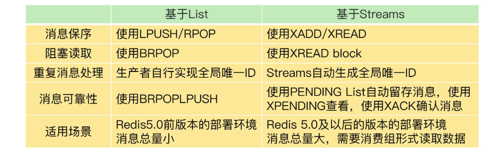

## 一亿个keys要统计

#### 聚合统计

> 所谓的聚合统计，就是指统计多个集合元素的聚合结果，包括：统计多个集合的共有元素（交集统计）；把两个集合相比，统计其中一个集合独有的元素（差集统计）；统计多个集合的所有元素（并集统计）

- 举例：统计手机 App 每天的新增用户数和第二天的留存用户数

> 利用sort集合保存数据，所有登陆过平台的key记作：key1=user:id,value=用户id,1,2,3,4...
>
> 另一个集合记作key2=user:id.:date(user:id.:20211227),value=用户id,1,2,3,4...
>
> 每天新增用户：sdiff(key1,key2)差集(每日用户 Set 和累计用户 Set)
>
> 留存用户：计算两日之间的交集即可(user:id:20200803 和 user:id:20200804 两个 Set 的交集)

#### 排序统计

- 举例：商网站上提供最新评论列表的场景

> list在分页获取时会出现重复获取最新数据的问题，这种场景可以选择有序集合。在面对需要展示最新列表、排行榜等场景时，如果数据更新频繁或者需要分页显示，建议你优先考虑使用 Sorted Set

#### 二值状态统计

> 二值状态就是指集合元素的取值就只有 0 和 1 两种。
>
> 商品有没有、用户在不在等，就可以使用 Bitmap，因为它只用一个 bit 位就能表示 0 或 1。在记录海量数据时，Bitmap 能够有效地节省内存空间

- 举例：签到打卡(bitmap)

> 假设我们要统计 ID 3000 的用户在 2020 年 **8 月**份的签到情况。
>
> 具体操作：
>
> ​	SETBIT uid:sign:3000:202008 2 1  记录该用户 8 月 3 号已签
>
> ​	GETBIT uid:sign:3000:202008 2  检查该用户 8 月 3 日是否签到
>
> ​	BITCOUNT uid:sign:3000:202008 统计该用户在 8 月份的签到次数

- 举例：记录了 1 亿个用户 10 天的签到情况，你有办法统计出这 10 天连续签到的用户总数吗(bitmap在查找位置：对用户 ID哈希计算，再对1亿取模，就得到这个用户映射的位)

> 在统计 1 亿个用户连续 10 天的签到情况时，你可以把每天的日期作为 key，每个 key 对应一个 1 亿位的 Bitmap，每一个 bit 对应一个用户当天的签到情况。接下来，我们对 10 个 Bitmap 做“与”操作，得到的结果也是一个 Bitmap。在这个 Bitmap 中，**只有 10 天都签到的用户对应的 bit 位上的值才会是 1**。最后，我们可以用 BITCOUNT 统计下 Bitmap 中的 1 的个数，这就是连续签到 10 天的用户总数了

#### 基数统计

> 基数统计就是指统计一个集合中不重复的元素个数

- 举例：统计网页的 UV

> set方式：
>
> ​	SADD page1:uv user1
>
> 如果 page1 非常火爆，UV 达到了千万，这个时候，一个 Set 就要记录千万个用户 ID。对于一个搞大促的电商网站而言，这样的页面可能有成千上万个，如果每个页面都用这样的一个 Set，就会消耗很大的**内存空间**
>
> 
>
> hash方式：
>
> ​	HSET page1:uv user1 1
>
> 即使用户 1 多次访问页面，重复执行这个 HSET 命令，也只会把 user1 的值设置为 1，仍然只记为 1 个独立访客。当要统计 UV 时，我们可以用 HLEN 命令统计 Hash 集合中的所有元素个数。**当页面很多时，Hash 类型也会消耗很大的内存空间**
>
> 
>
> **HyperLogLog**方式(推荐)：
>
> > HyperLogLog 是一种用于统计基数的数据集合类型，它的最大优势就在于，当集合元素数量非常多时，它计算基数所需的空间总是固定的，而且还很小。在 Redis 中，每个 HyperLogLog 只需要花费 12 KB 内存，就可以计算接近 2^64 个元素的基数
>
> PFADD page1:uv user1 user2 user3 user4 user5  PFADD 命令（用于向 HyperLogLog 中添加新元素）把访问页面的每个用户都添加到 HyperLogLog 中
>
> PFCOUNT page1:uv PFCOUNT 命令直接获得 page1 的 UV 值了，这个命令的作用就是返回 HyperLogLog 的统计结果
>
> HyperLogLog 的统计规则是基于概率完成的，所以它给出的统计结果是有一定误差的，标准误算率是 0.81%。这也就意味着，你使用 HyperLogLog 统计的 UV 是 100 万，但实际的 UV 可能是 101 万。虽然误差率不算大，但是，如果你需要精确统计结果的话，最好还是继续用 **Set 或 Hash 类型**

## 队列实现

#### list数据类型

> LPUSH+RPOP实现队列，但是lpush写入队列后，不会主动通知消费者，消费者只能while(true)不停的去循环读取，造成cpu无果的消耗。因此可以用BRPOP命令，**BRPOP 命令也称为阻塞式读取，客户端在没有读到队列数据时，自动阻塞，直到有新的数据写入队列，再开始读取新数据**
>
> 为了留存消息，List 类型提供了 BRPOPLPUSH 命令，这个命令的作用是让消费者程序从一个 List 中读取消息，同时，Redis 会把这个消息再插入到另一个 List（可以叫作备份 List）留存。这样一来，如果消费者程序读了消息但没能正常处理，等它重启后，就可以从备份 List 中重新读取消息并进行处理了
>
> List 类型并不支持消费组的实现：多个消费者程序组成一个消费组

#### 基于 Streams 的消息队列解决方案

> Streams 是 Redis 专门为消息队列设计的数据类型，支持消费组，适用于消息量并不是非常巨大，数据不是非常重要，从而不必引入其他消息组件的场景，如发短信，站内信

