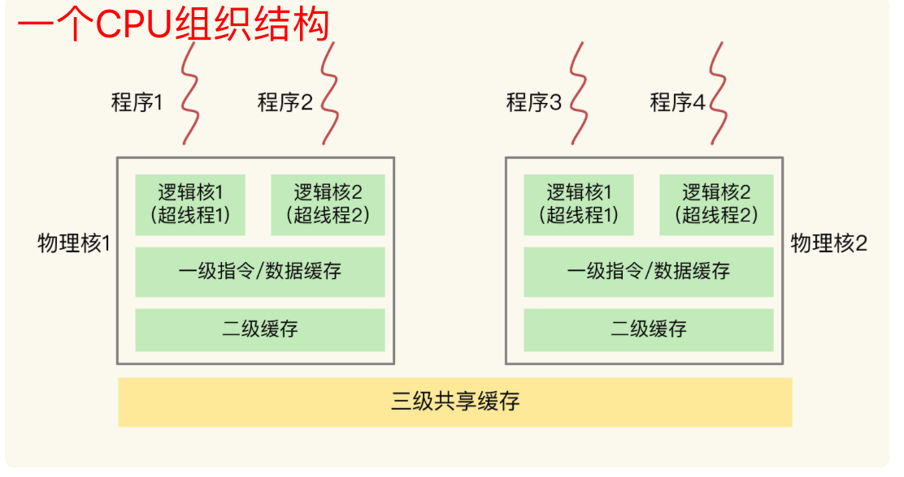

#### 一致性hash

> https://www.zsythink.net/archives/1182
>
> https://zh.wikipedia.org/wiki/%E4%B8%80%E8%87%B4%E5%93%88%E5%B8%8C

#### cap定义

> ​	CAP原则又称CAP定理，指的是在一个分布式系统中，一致性（Consistency）、可用性（Availability）、分区容错性（Partition tolerance）。CAP 原则指的是，这三个要素最多只能同时实现两点，不可能三者兼顾。
>
> 一致性（C）：在分布式系统中的所有数据备份，在同一时刻是否同样的值。（等同于所有节点访问同一份最新的数据副本）
>
> 可用性（A）：保证每个请求不管成功或者失败都有响应。
>
> 分区容忍性（P）：系统中任意信息的丢失或失败不会影响系统的继续运作。

#### bitmap

- 网址

> https://www.cnblogs.com/dragonsuc/p/10993938.html
>
> http://www.woshipm.com/it/4070505.html

- 实例

> 1. 针对独立用户的统计。比如想知道某个应用，每天有多少个独立用户使用了该应用？可以根据该应用的用户访问日志，每天生成一个BitMap；每个用户对应BitMap里的一个位置，如果当天访问了，该位置就置为1，否则为0。这样要知道当天这个应用的总独立用户数，只需要看看那天的BitMap里边有多少个1。
> 2. 用户回访的统计。比如想知道某个应用，昨天使用过的用户中，有多少今天也使用了？可以在例子1（每天保存一个独立活跃用户的BitMap）的基础上，将昨天的BitMap和今天的BitMap进行AND操作，然后数一下生成的BitMap里有多少个1即可。

#### 进制

- 正负

> 正数： 高位0
>
> 负数：高位1

#### 位运算

- 网址

https://www.zhihu.com/question/38206659

- 常用技巧

> 前提：b 为 2^n
>
> ```test
> a % b == a & (b - 1)
> ```
>
> 原理：
>
> https://mp.weixin.qq.com/s?__biz=MzI3NzE0NjcwMg==&mid=2650120877&idx=1&sn=401bb7094d41918f1a6e142b6c66aaac&chksm=f36bbf8cc41c369aa44c319942b06ca0f119758b22e410e8f705ba56b9ac6d4042fe686dbed4&mpshare=1&scene=1&srcid=1010L0NNyoRB5lVoryo00awY#rd
>
> https://juejin.cn/post/6844903689417818120
>
> 不使用第三个变量交换变量值
>
> ```test
> a  ^= b
> b  ^= a
> a  ^= b
> ```
>
> 统计二进制中 1 的个数
>
> ```test
> count = 0  
> while(a){  
>   a = a & (a - 1);  //由x & (x - 1)消去x最后一位的1可知。不断使用 x & (x - 1) 消去x最后一位的1，计算总共消去了多少次即可
>   count++;  
> } 
> 
> x & (x - 1) 用于消去x最后一位的1
> x = 1100
> x - 1 = 1011
> x & (x - 1) = 1000
> ```
>
> 奇偶数判断
>
> ```text
> 0 == (a & 1)
> ```

#### CPU组织结构

> 一个CPU多个运行核心(也叫物理核)，一般一个物理核有两个超线程(逻辑核)，
>
> **逻辑CPU的数量，结果高于5的时候就表明系统在超负荷运转了**
>
> lscpu查看系统的cpu个数



