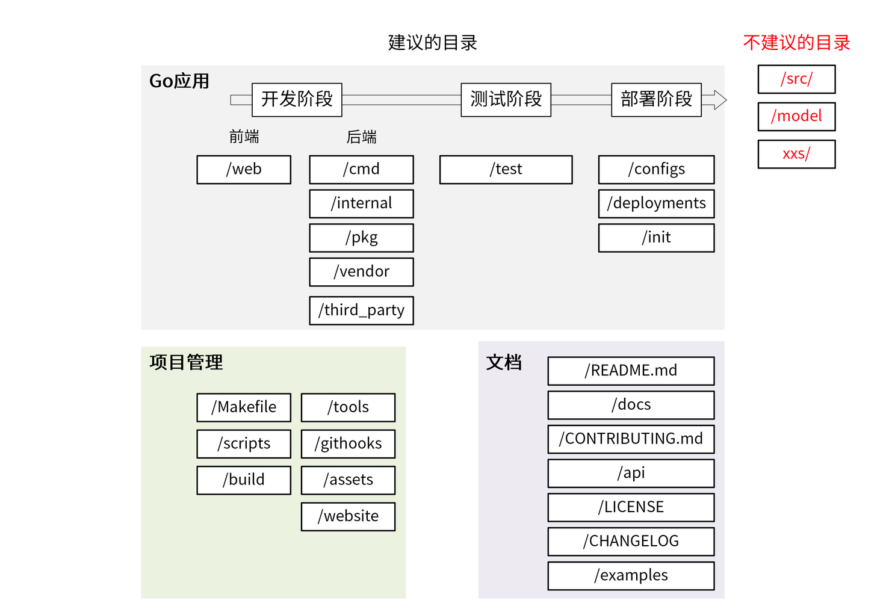

```math
Go核心知识笔记
```

## 目录文件

- bin文件夹存放go install命名生成的可执行文件
- pkg文件夹是存在go编译生成的文件
- src存放的是非Go Module项目源代码

## 技巧

- 让多个goroutine按照既定的顺序执行

```
func main() {
	var count uint32
	trigger := func(i uint32, fn func()) {
		for {
			if n := atomic.LoadUint32(&count); n == i {
				fn()
				atomic.AddUint32(&count, 1)
				break
			}
			time.Sleep(time.Nanosecond)
		}
	}
	for i := uint32(0); i < 10; i++ {
		go func(i uint32) {
			fn := func() {
				fmt.Println(i)
			}
			trigger(i, fn)
		}(i)
	}
	trigger(10, func() {})
}
```


## 基础知识

- https://draveness.me/golang/docs/part2-foundation/ch05-keyword/golang-panic-recover/
- ==区间索引==左开右闭(比如a = [1, 2, 3, 4, 5], a[0:3] = [1, 2, 3]，不包含最后一个元素。
- map类型的key可以是任何类型，只要可以用==去比较就行。map类型的迭代顺序是 ==随机==的，这点注意一下。
- ==指针==是可见的内存地址，==&操作符可以返回一个变量的内存地址==，并且*操作符可以获取指针指向的变量内容，但是在Go语言里==没有指针运算==，也就是不能像c语言里可以对指针进行加或减操作。
- &x表达式取x变量的==内存地址==，指针对应的数据类型是*int,取指针的值 *p。
- new声明一个指针，new分配返回的是指针，即类型*T；make返回引用，即T。
- Unicode字符==rune类型是和int32等价的类型==，通常用于表示一个Unicode码点。这两个名称可以互换使用。同样==byte也是uint8类型的等价类型==，==byte类型一般用于强调数值是一个原始的数据而不是一个小的整数==。无符号的整数类型uintptr，没有指定具体的bit大小但是足以容纳指针。
- Go语言中，%==取模==运算符的符号和被取==模数的符号总是一致的，因此-5%3和-5%-3结果都是-2。==除法运算符/的行为则依赖于操作数是否全为整数，比如5.0/4.0的结果是1.25，但是5/4的结果是1，因为整数除法会向着0方向截断余数。
- 将一个==大尺寸==的整数类型转为一个==小尺寸==的整数类型，或者是将一个浮点数转为整数，可能会改变数值或丢失精度。浮点数到整数的转换将丢失任何小数部分，然后向数轴零方向截断。
- 对于小于256的码点值可以写在一个十六进制转义字节中，例如\x41对应字符'A'，但是对于更大的码点则必须使==用\u或\U转义==形式。
- 类型==chan<- int==表示一个只发送int的channel，只能发送不能接收。相反，==类型<-chan int表示==一个只接收int的channel，只能接收不能发送。（箭头<-和关键字chan的相对位置表明了channel的方向。）这种限制将在编译期检测

## 常见陷阱和错误
- 永远不要使用形如 var p*a 声明变量，这会混淆指针声明和乘法运算
- 永远不要在for循环自身中改变计数器变量
- 永远不要在for-range循环中使用一个值去改变自身的值
- 永远不要将goto和前置标签一起使用
- **永远不要使用new()一个map，一直使用make**
- 当为一个类型定义一个String()方法时，不要使用fmt.Print或者类似的代码
- 永远不要忘记当终止缓存写入时，使用==Flush==函数
- **永远不要忽略错误提示，忽略错误会导致程序崩溃**
- 不要使用全局变量或者共享内存，这会使并发执行的代码变得不安全
- **仅当一个结构体的方法想改变结构体时，使用结构体指针作为方法的接受者，否则使用一个结构体值类型**
- 当对字符串频繁操作时候，使用诸如a += b形式连接字符串效率低下，尤其在一个循环内部使用这种形式。这会导致大量的内存开销和拷贝。应该使用一个字符数组代替字符串，将字符串内容写入一==个缓存==中。
- 短声明导致变量覆盖
```
remember变量永远不会在if语句外面变成true，如果something为true，由于使用了短声明:=，if语句内部的新变量remember将覆盖外面的remember变量，
并且该变量的值为true，但是在if语句外面，变量remember的值变成了false
var remember bool = false
if something {
    remember := true //错误
    
    remember = true //正确
}

///////////////
func shadow() (err error) {
	x, err := check1() // x是新创建变量，err是被赋值
	if err != nil {
		return // 正确返回err
	}
	if y, err := check2(x); err != nil { // y和if语句中err被创建
		return // if语句中的err覆盖外面的err，所以错误的返回nil！
	} else {
		fmt.Println(y)
	}
	return
}
```
- 字符串
```
//修改字符串值
str := "hello"
c := []byte(str)
c[0] = 'c'
fmt.Print(string(c))

```
- 当数组元素是稀疏的（例如有很多0值或者空值nil），使用映射会降低内存消耗
- 当定义一个方法时，使用指针类型作为方法的接受者
- 尽可能的使用切片代替数组, 尽可能的使用数组和切片代替映射。
- 如果只想获取切片中某项值，不需要值的索引，尽可能的使用for range去遍历切片，这比必须查询切片中的每个元素要快一些。
- 判断Golang接口是否实现

```
  //今天在看beego config模块fake.go文件的时候，看到var _ Configer = new(fakeConfigContainer)这行代码，一开始不懂这行代码的功能是什么？

后面了解到这行代码的作用是判断fakeConfigContainer结构体是否实现了Configer这个接口
  type A interface {
    Print()
}

type B struct {
}

func (B)Print()  {
}

//这样写的话，就可以确保B结构实现了A接口，如果没有实现的话，ide会提示报错或者编译的时候会报错
var _ A = new(B)
var _ A = (*B)(nil)
```

- go常用模式实例

> - 单例模式
>
> ```
> //饿汉方式 全局的单例实例在包被加载时创建
> package singleton
> 
> type singleton struct {
> }
> 
> var ins *singleton = &singleton{}
> 
> func GetInsOr() *singleton {
>     return ins
> }
> 
> // 懒汉方式指全局的单例实例在第一次被使用时创建
> //线程非安全 会出现并发问题
> package singleton
> 
> type singleton struct {
> }
> 
> var ins *singleton
> 
> func GetInsOr() *singleton {
>     if ins == nil {
>         ins = &singleton{}
>     }
>     
>     return ins
> }
> 
> //解决懒汉并发安全问题 加锁
> import "sync"
> 
> type singleton struct {
> }
> 
> var ins *singleton
> var mu sync.Mutex
> 
> func GetIns() *singleton {
>   if ins == nil {
>     mu.Lock()
>     if ins == nil {
>       ins = &singleton{}
>     }
>     mu.Unlock()
>   }
>   return ins
> }
> 
> //推荐 优雅方式 sync.Once方式
> package singleton
> 
> import (
>     "sync"
> )
> 
> type singleton struct {
> }
> 
> var ins *singleton
> var once sync.Once
> 
> func GetInsOr() *singleton {
> 		//once.Do
>     once.Do(func() {
>         ins = &singleton{}
>     })
>     return ins
> }
> ```
>
> - 工厂模式
>
> ```
> //简单工厂
> type Person struct {
>   Name string
>   Age int
> }
> 
> func (p Person) Greet() {
>   fmt.Printf("Hi! My name is %s", p.Name)
> }
> 
> func NewPerson(name string, age int) *Person {
>   return &Person{
>     Name: name,
>     Age: age,
>   }
> }
> 
> //抽象工厂
> type Person interface {
>   Greet()
> }
> 
> type person struct {
>   name string
>   age int
> }
> 
> func (p person) Greet() {
>   fmt.Printf("Hi! My name is %s", p.name)
> }
> 
> // Here, NewPerson returns an interface, and not the person struct itself
> func NewPerson(name string, age int) Person {
>   return person{
>     name: name,
>     age: age,
>   }
> }
> 
> //工厂方法
> type Person struct {
>   name string
>   age int
> }
> 
> func NewPersonFactory(age int) func(name string) Person {
>   return func(name string) Person {
>   //闭包
>     return Person{
>       name: name,
>       age: age,
>     }
>   }
> }
> 
> 
> newBaby := NewPersonFactory(1)
> baby := newBaby("john")
> 
> newTeenager := NewPersonFactory(16)
> teen := newTeenager("jill")
> ```
>
> - 策略模式
>
> ```
> 
> package strategy
> 
> // 策略模式
> 
> // 定义一个策略类
> type IStrategy interface {
>   do(int, int) int
> }
> 
> // 策略实现：加
> type add struct{}
> 
> func (*add) do(a, b int) int {
>   return a + b
> }
> 
> // 策略实现：减
> type reduce struct{}
> 
> func (*reduce) do(a, b int) int {
>   return a - b
> }
> 
> // 具体策略的执行者
> type Operator struct {
>   strategy IStrategy
> }
> 
> // 设置策略
> func (operator *Operator) setStrategy(strategy IStrategy) {
>   operator.strategy = strategy
> }
> 
> // 调用策略中的方法
> func (operator *Operator) calculate(a, b int) int {
>   return operator.strategy.do(a, b)
> }
> 
> //使用
> func TestStrategy(t *testing.T) {
>   operator := Operator{}
> 
>   operator.setStrategy(&add{})
>   result := operator.calculate(1, 2)
>   fmt.Println("add:", result)
> 
>   operator.setStrategy(&reduce{})
>   result = operator.calculate(2, 1)
>   fmt.Println("reduce:", result)
> }
> ```
>
> - 模板模式
>
> ```
> 
> package template
> 
> import "fmt"
> 
> type Cooker interface {
>   fire()
>   cooke()
>   outfire()
> }
> 
> // 类似于一个抽象类
> type CookMenu struct {
> }
> 
> func (CookMenu) fire() {
>   fmt.Println("开火")
> }
> 
> // 做菜，交给具体的子类实现
> func (CookMenu) cooke() {
> }
> 
> func (CookMenu) outfire() {
>   fmt.Println("关火")
> }
> 
> // 封装具体步骤
> func doCook(cook Cooker) {
>   cook.fire()
>   cook.cooke()
>   cook.outfire()
> }
> 
> type XiHongShi struct {
>   CookMenu
> }
> 
> func (*XiHongShi) cooke() {
>   fmt.Println("做西红柿")
> }
> 
> type ChaoJiDan struct {
>   CookMenu
> }
> 
> func (ChaoJiDan) cooke() {
>   fmt.Println("做炒鸡蛋")
> }
> 
> //执行
> func TestTemplate(t *testing.T) {
>   // 做西红柿
>   xihongshi := &XiHongShi{}
>   doCook(xihongshi)
> 
>   fmt.Println("\n=====> 做另外一道菜")
>   // 做炒鸡蛋
>   chaojidan := &ChaoJiDan{}
>   doCook(chaojidan)
> 
> }
> ```
>
> - 代理模式
>
> ```
> 
> package proxy
> 
> import "fmt"
> 
> type Seller interface {
>   sell(name string)
> }
> 
> // 火车站
> type Station struct {
>   stock int //库存
> }
> 
> func (station *Station) sell(name string) {
>   if station.stock > 0 {
>     station.stock--
>     fmt.Printf("代理点中：%s买了一张票,剩余：%d \n", name, station.stock)
>   } else {
>     fmt.Println("票已售空")
>   }
> 
> }
> 
> // 火车代理点
> type StationProxy struct {
>   station *Station // 持有一个火车站对象
> }
> 
> func (proxy *StationProxy) sell(name string) {
>   if proxy.station.stock > 0 {
>     proxy.station.stock--
>     fmt.Printf("代理点中：%s买了一张票,剩余：%d \n", name, proxy.station.stock)
>   } else {
>     fmt.Println("票已售空")
>   }
> }
> ```
>
> - 选项模式(重点)
>
> ```
> //第一种
> 
> package proxy
> 
> import "fmt"
> 
> type Seller interface {
>   sell(name string)
> }
> 
> // 火车站
> type Station struct {
>   stock int //库存
> }
> 
> func (station *Station) sell(name string) {
>   if station.stock > 0 {
>     station.stock--
>     fmt.Printf("代理点中：%s买了一张票,剩余：%d \n", name, station.stock)
>   } else {
>     fmt.Println("票已售空")
>   }
> 
> }
> 
> // 火车代理点
> type StationProxy struct {
>   station *Station // 持有一个火车站对象
> }
> 
> func (proxy *StationProxy) sell(name string) {
>   if proxy.station.stock > 0 {
>     proxy.station.stock--
>     fmt.Printf("代理点中：%s买了一张票,剩余：%d \n", name, proxy.station.stock)
>   } else {
>     fmt.Println("票已售空")
>   }
> }
> 
> //第二种
> 
> package options
> 
> import (
>   "time"
> )
> 
> const (
>   defaultTimeout = 10
>   defaultCaching = false
> )
> 
> type Connection struct {
>   addr    string
>   cache   bool
>   timeout time.Duration
> }
> 
> type ConnectionOptions struct {
>   Caching bool
>   Timeout time.Duration
> }
> 
> func NewDefaultOptions() *ConnectionOptions {
>   return &ConnectionOptions{
>     Caching: defaultCaching,
>     Timeout: defaultTimeout,
>   }
> }
> 
> // NewConnect creates a connection with options.
> func NewConnect(addr string, opts *ConnectionOptions) (*Connection, error) {
>   return &Connection{
>     addr:    addr,
>     cache:   opts.Caching,
>     timeout: opts.Timeout,
>   }, nil
> }
> 
> //第三种 推荐
> 
> package options
> 
> import (
>   "time"
> )
> 
> type Connection struct {
>   addr    string
>   cache   bool
>   timeout time.Duration
> }
> 
> const (
>   defaultTimeout = 10
>   defaultCaching = false
> )
> 
> type options struct {
>   timeout time.Duration
>   caching bool
> }
> 
> // Option overrides behavior of Connect.
> type Option interface {
>   apply(*options)
> }
> 
> type optionFunc func(*options)
> 
> func (f optionFunc) apply(o *options) {
>   f(o)
> }
> 
> func WithTimeout(t time.Duration) Option {
>   return optionFunc(func(o *options) {
>     o.timeout = t
>   })
> }
> 
> func WithCaching(cache bool) Option {
>   return optionFunc(func(o *options) {
>     o.caching = cache
>   })
> }
> 
> // Connect creates a connection.
> func NewConnect(addr string, opts ...Option) (*Connection, error) {
>   options := options{
>     timeout: defaultTimeout,
>     caching: defaultCaching,
>   }
> 
>   for _, o := range opts {
>     o.apply(&options)
>   }
> 
>   return &Connection{
>     addr:    addr,
>     cache:   options.caching,
>     timeout: options.timeout,
>   }, nil
> }
> 
> //选项模式
> package options
> 
> //意图：通过修改选项，创建出功能不同的实例
> //解决:由于go语言没有默认值，继承，多态，所有使用选项模式来达到默认值，多态的效果
> 
> //实例:配置一个日志
> 
> import (
> 	"io"
> 	"log"
> 	"os"
> )
> 
> type Option func(*Options)
> 
> type Options struct {
> 	Out    io.Writer //日志输出
> 	Prefix string    //日志前缀
> 	Flag   int       //日志标记
> }
> 
> //设置输出
> func WithOut(out io.Writer) Option {
> 	return func(o *Options) {
> 		o.Out = out
> 	}
> }
> 
> //设置前缀
> func WithPrefix(prefix string) Option {
> 	return func(o *Options) {
> 		o.Prefix = prefix
> 	}
> }
> 
> //设置标记
> func WithFlag(flag int) Option {
> 	return func(o *Options) {
> 		o.Flag = flag
> 	}
> }
> 
> //新建一个日志
> func NewLog(opts ...Option) *log.Logger {
> 	//设置默认选项
> 	o := &Options{
> 		Out:    os.Stderr,
> 		Prefix: "",
> 		Flag:   log.Ltime,
> 	}
> 	//使用自定义选项覆盖默认选项
> 	for _, opt := range opts {
> 		opt(o)
> 	}
> 	return log.New(o.Out, o.Prefix, o.Flag)
> }
> ```
>
> 

## 实例

### channel

- channel超时机制
```
func main() {
	ch := make(chan int)
	quit := make(chan bool)

	//新开协程
	go func() {
		for {
			select {
			case num := <-ch: //每次这里满足条件
				fmt.Println("num = ", num)
			case <-time.After(3 * time.Second):
				//如果ch一直没数据会阻塞，select检测其他case条件，直到3秒后超时
				fmt.Println("超时了")
				quit <- true
			}
		}
	}()

	for i := 0; i < 5; i++ {
		ch <- i
		time.Sleep(time.Second)
	}

	<-quit

	fmt.Println("程序结束")
}

```
- channel多路复用
```
//随机向 ch 中写入一个 0 或者 1
func main() {
	ch := make(chan int, 1)

	for {
		select {
		case ch <- 0:
		case ch <- 1:
		}

		fmt.Println(<-ch)
	}
}

```
- 发布订阅模型
```
package main

import (
	"fmt"
	"strings"
	"sync"
	"time"
)

type (
	subscriber chan interface{}         // 订阅者为一个管道
	topicFunc  func(v interface{}) bool // 主题为一个过滤器
)

// 发布者对象
type Publisher struct {
	m           sync.RWMutex             // 读写锁
	buffer      int                      // 订阅队列的缓存大小
	timeout     time.Duration            // 发布超时时间
	subscribers map[subscriber]topicFunc // 订阅者信息
}

func NewPublisher(publishTimeout time.Duration, buffer int) *Publisher {
	return &Publisher{
		buffer:      buffer,
		timeout:     publishTimeout,
		subscribers: make(map[subscriber]topicFunc),
	}
}

func (p *Publisher) Subscribe() chan interface{} {
	return p.SubscribeTopic(nil)
}

func (p *Publisher) SubscribeTopic(topic topicFunc) chan interface{} {
	ch := make(chan interface{}, p.buffer)
	p.m.Lock()
	p.subscribers[ch] = topic
	p.m.Unlock()

	return ch
}

func (p *Publisher) Evict(sub chan interface{}) {
	p.m.Lock()
	defer p.m.Unlock()

	delete(p.subscribers, sub)
	close(sub)
}

func (p *Publisher) Publish(v interface{}) {
	p.m.RLock()
	defer p.m.RUnlock()

	var wg sync.WaitGroup
	//这里注意p.subscribers的值，map中有两个ch的key
	for sub, topic := range p.subscribers {
		wg.Add(1)
		go p.sendTopic(sub, topic, v, &wg)
	}
	wg.Wait()
}

// 发送主题，可以容忍一定的超时
func (p *Publisher) sendTopic(
	sub subscriber, topic topicFunc, v interface{}, wg *sync.WaitGroup,
) {
	defer wg.Done()
	//这里条件，nil和topic值，每次Publish会把不满足条件放到Nil中去
	//最好打印一下 想一下它的执行流程
	// 	== hello,  world! 0xc0000b2180 0x10a7560
	// =sss= hello,  world! 0xc0000b2120 <nil>
	// =sss= hello, golang! 0xc0000b2120 <nil>
	// =sss= hello, golang! 0xc0000b2180 0x10a7560
	if topic != nil && !topic(v) {
		fmt.Println("==", v, sub, topic)
		return
	}

	select {
	case sub <- v:
	case <-time.After(p.timeout):
	}
}

// 关闭发布者对象，同时关闭所有的订阅者管道。
func (p *Publisher) Close() {
	p.m.Lock()
	defer p.m.Unlock()

	for sub := range p.subscribers {
		delete(p.subscribers, sub)
		close(sub)
	}
}

func main() {
	p := NewPublisher(100*time.Millisecond, 10)
	defer p.Close()

	all := p.Subscribe()

	golang := p.SubscribeTopic(func(v interface{}) bool {
		if s, ok := v.(string); ok {
			return strings.Contains(s, "golang")
		}
		return false
	})

	p.Publish("hello,  world!")
	p.Publish("hello, golang!")

	go func() {
		for msg := range all {
			fmt.Println("all:", msg)
		}
	}()

	go func() {
		for msg := range golang {
			fmt.Println("golang:", msg)
		}
	}()

	// 运行一定时间后退出
	time.Sleep(3 * time.Second)

}

```
- 锁
```
//trylock顾名思义，尝试加锁（抢占式加锁），加锁成功执行后续流程，如果加锁失败的话也不会阻塞，而会直接返回加锁的结果
// Lock try lock
type Lock struct {
    c chan struct{}
}

// NewLock generate a try lock
func NewLock() Lock {
    var l Lock
    l.c = make(chan struct{}, 1)
    l.c <- struct{}{}
    return l
}

// Lock try lock, return lock result
func (l Lock) Lock() bool {
    lockResult := false
    select {
    case <-l.c:
        lockResult = true
    default:
    }
    return lockResult
}

// Unlock , Unlock the try lock
func (l Lock) Unlock() {
    l.c <- struct{}{}
}

var counter int

func main() {
    var l = NewLock()
    var wg sync.WaitGroup
    for i := 0; i < 10; i++ {
        wg.Add(1)
        go func() {
            defer wg.Done()
            if !l.Lock() {
                // log error
                println("lock failed")
                return
            }
            counter++
            println("current counter", counter)
            l.Unlock()
        }()
    }
    wg.Wait()
}
```
- recover必须在defer函数中运行
```
func main() {
    //必须在defer函数中直接调用才有效
    defer func() {
        recover()
    }()
    panic(1)
}

//在循环内部执行defer(函数退出才执行)语句

func main() {
//defer在函数退出时才能执行，在for执行defer会导致资源延迟释放
    for i := 0; i < 5; i++ {
        f, err := os.Open("/path/to/file")
        if err != nil {
            log.Fatal(err)
        }
        defer f.Close()
    }
}

//解决的方法可以在for中构造一个局部函数，在局部函数内部执行defer
func main() {
    for i := 0; i < 5; i++ {
        func() {
            f, err := os.Open("/path/to/file")
            if err != nil {
                log.Fatal(err)
            }
            defer f.Close()
        }()
    }
}
```
- web http接口

https://docs.hacknode.org/gopl-zh/ch7/ch7-07.html

## go module

- GO111MODULE ，这里的 111，是 v1.11 的象征标志
```
GO111MODULE=off禁用模块支持，编译时会从GOPATH和vendor文件夹中查找包。
GO111MODULE=on启用模块支持，编译时会忽略GOPATH和vendor文件夹，只根据 go.mod下载依赖。
GO111MODULE=auto，当项目在$GOPATH/src外且项目根目录有go.mod文件时，自动开启模块支持。
```

## 极客时间课后笔记

Quick Start：
https://golang.org/doc/install
https://tour.golang.org/welcome/1

语言层面：
《Effective Go》 https://golang.org/doc/effective_go.html （我是看这个入门，官方推荐的文档，轻松易读
https://item.jd.com/12187988.html （比较详细的书籍

实战 & 规范：

《Code Review Comments》
en：https://github.com/golang/go/wiki/CodeReviewComments
cn：https://studygolang.com/articles/10960

《High Performance Go Workshop》
https://dave.cheney.net/high-performance-go-workshop/dotgo-paris.html#overview

《Practical Go: Real world advice for writing maintainable Go programs》
https://dave.cheney.net/practical-go/presentations/qcon-china.html

Runtime：
https://draveness.me/golang/ （类似书籍比较多，还有一本雨痕的可以找找

官方文档：
golang.org
godoc.org
=================

其他国内的书我看的比较少，最推荐上面的Effective Go，另外了解下B站的框架：
https://github.com/bilibili/kratos


[啤酒]Go 进阶训练营免费福利资料

链接:https://pan.baidu.com/s/1O3jKZ-qvXnWkJbaupoVlmQ 密码:33lt

Go 并发编程 140 页干货 PPT：
链接: https://pan.baidu.com/s/1iWH3_IXaTwwBcTl4h3kz-w 密码: 61ys

大厂软件开发案例：https://con.infoq.cn/archives/?conf=qcon


## go web项目目录结构

```
.
├── Makefile
├── README.md
├── command                     
│   └── sword.go
├── config                      全局配置
│   └── env.go
├── connections                 存储连接
│   ├── database
│   │   ├── mongodb
│   │   └── mysql
│   └── redis
│       └── redis.go
├── controllers                 控制器
│   └── MainController.go
├── filters                     中间件
│   ├── auth                    认证中间件
│   │   ├── drivers             认证引擎
│   │   └── auth.go   
│   └── filter.go              
├── frontend                    前端资源
│   ├── assets
│   │   ├── css
│   │   ├── images
│   │   └── js
│   ├── dist
│   └── templates
│       └── index.tpl
├── handle.go                   全局错误处理
├── main.go                     
├── models                      模型
│   └── User.go
├── module                      项目模块
│   │── schedule
│   │   └── schedule.go   
│   │── logger
│   │   └── logger.go 
│   └── server
│       └── server.go           定时任务模块
├── routers                     路由
│   └── api_routers.go          
├── routers.go                  路由初始化设置
├── routers_test.go             api测试
├── storage                     
│   ├── cache                   缓存文件
│   └── logs                    项目日志
│       ├── access.log          
│       └── error.log
└── vendor                      govendor 第三方包
```

```
goproj_org
├── todo.go    # main 入口
├── go.mod
├── go.sum
├── config    # 配置文件存放
│   └── config.yaml
├── controller  # api 接口逻辑，http handler
│   ├── DemoController.go
│   └── TodoController.go
├── model      # model定义
│   └── Todo.go
├── router    # 路由入口
│   ├── middleware  # gin框架 自定义中间件，中间件一般用于路由中，故放到这里
│   │   └── jwt.go
│   └── router.go
├── service 
│   ├── ConfigService.go
│   ├── DBService.go
│   └── TodoService.go
└── util      # 公共函数部分，比如加密，时间处理等
 └── encrypt.go</pre>
```

```
projectName  # 项目名称
|-- app  # 应用程序目录
|---- controllers  # 控制器，入参校验
|---- middleware  # 中间件
|---- routers  # 路由
|---- services  # 业务逻辑处理
|-- config  # 配置文件
|-- dao  # 数据库访问
|-- models  # 数据模型
|-- storage #存储
|---- cache  # 缓存
|---- logs  # 日志
|-- main.go # 程序入口
```

```
//极客时间
├── api
│   ├── openapi
│   └── swagger
├── build
│   ├── ci
│   ├── docker
│   │   ├── iam-apiserver
│   │   ├── iam-authz-server
│   │   └── iam-pump
│   ├── package
├── CHANGELOG
├── cmd
│   ├── iam-apiserver
│   │   └── apiserver.go
│   ├── iam-authz-server
│   │   └── authzserver.go
│   ├── iamctl
│   │   └── iamctl.go
│   └── iam-pump
│       └── pump.go
├── configs
├── CONTRIBUTING.md
├── deployments
├── docs
│   ├── devel
│   │   ├── en-US
│   │   └── zh-CN
│   ├── guide
│   │   ├── en-US
│   │   └── zh-CN
│   ├── images
│   └── README.md
├── examples
├── githooks
├── go.mod
├── go.sum
├── init
├── internal
│   ├── apiserver
│   │   ├── api
│   │   │   └── v1
│   │   │       └── user
│   │   ├── apiserver.go
│   │   ├── options
│   │   ├── service
│   │   ├── store
│   │   │   ├── mysql
│   │   │   ├── fake
│   │   └── testing
│   ├── authzserver
│   │   ├── api
│   │   │   └── v1
│   │   │       └── authorize
│   │   ├── options
│   │   ├── store
│   │   └── testing
│   ├── iamctl
│   │   ├── cmd
│   │   │   ├── completion
│   │   │   ├── user
│   │   └── util
│   ├── pkg
│   │   ├── code
│   │   ├── options
│   │   ├── server
│   │   ├── util
│   │   └── validation
├── LICENSE
├── Makefile
├── _output
│   ├── platforms
│   │   └── linux
│   │       └── amd64
├── pkg
│   ├── util
│   │   └── genutil
├── README.md
├── scripts
│   ├── lib
│   ├── make-rules
├── test
│   ├── testdata
├── third_party
│   └── forked
└── tools


├── apiserver
│   ├── api
│   │   └── v1
│   │       └── user
│   ├── options
│   ├── config
│   ├── service
│   │   └── user.go
│   ├── store
│   │   ├── mysql
│   │   │   └── user.go
│   │   ├── fake
│   └── testing
├── authzserver
│   ├── api
│   │   └── v1
│   ├── options
│   ├── store
│   └── testing
├── iamctl
│   ├── cmd
│   │   ├── cmd.go
│   │   ├── info
└── pkg
    ├── code
    ├── middleware
    ├── options
    └── validation
```




# 极客学习连接

目录结构 https://github.com/golang-standards/project-layout/blob/master/README_zh.md

https://go.dev/blog/wire

- errgroup

https://driverzhang.github.io/post/goroutine%E6%97%A0%E6%B3%95%E6%8A%9B%E9%94%99%E5%B0%B1%E7%94%A8errgroup/

https://lailin.xyz/post/go-training-week3-errgroup.html

https://pkg.go.dev/golang.org/x/sync/errgroup

- context

https://zhuanlan.zhihu.com/p/68792989

https://talks.golang.org/2014/gotham-context.slide#1 重要

- go 训练营作业github

https://github.com/Go-000/Go-000/issues/69

- go基础库 开源资料

https://github.com/go-basic

- errors

https://pkg.go.dev/errors

https://golang.org/doc/effective_go#errors

https://go.dev/blog/error-handling-and-go

- go excel库

https://learnku.com/articles/23656

- go并行 并发

https://www.cnblogs.com/sparkdev/p/10930120.html

- go-kratos

https://github.com/go-kratos/kratos-layout

- go map

https://zhuanlan.zhihu.com/p/66676224

- go 官方文档

https://golang.org/doc/

- go kratos

https://go-kratos.dev/docs/intro/layout


```
https://golang.org/doc/effective_go
https://github.com/golang/go/wiki/CodeReviewComments
https://github.com/golang/go/wiki
https://golang.org/ref/spec

https://go.dev/blog/organizing-go-code
https://go.dev/blog/


```

https://github.com/go-eagle/eagle  框架

- google api

https://www.bookstack.cn/read/API-design-guide/API-design-guide-04-%E6%A0%87%E5%87%86%E6%96%B9%E6%B3%95.md 

```
redis cow机制
golang cow
go 基础库
```

