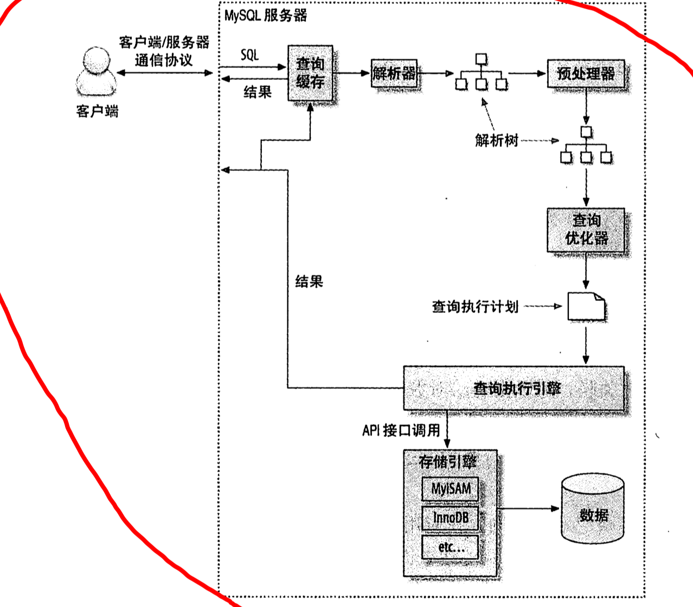
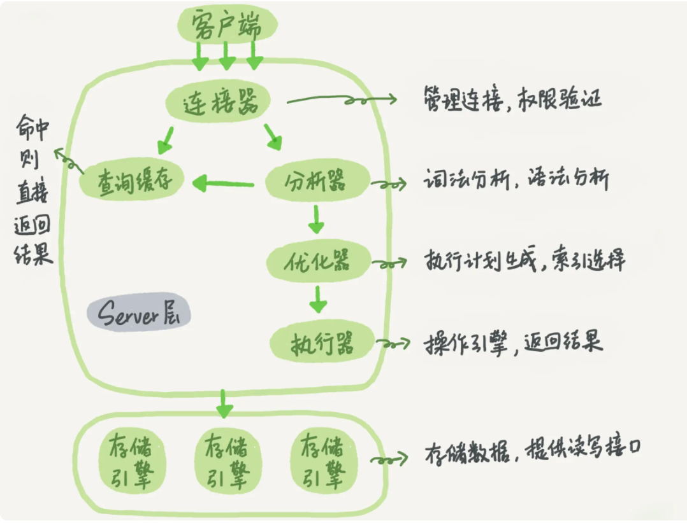
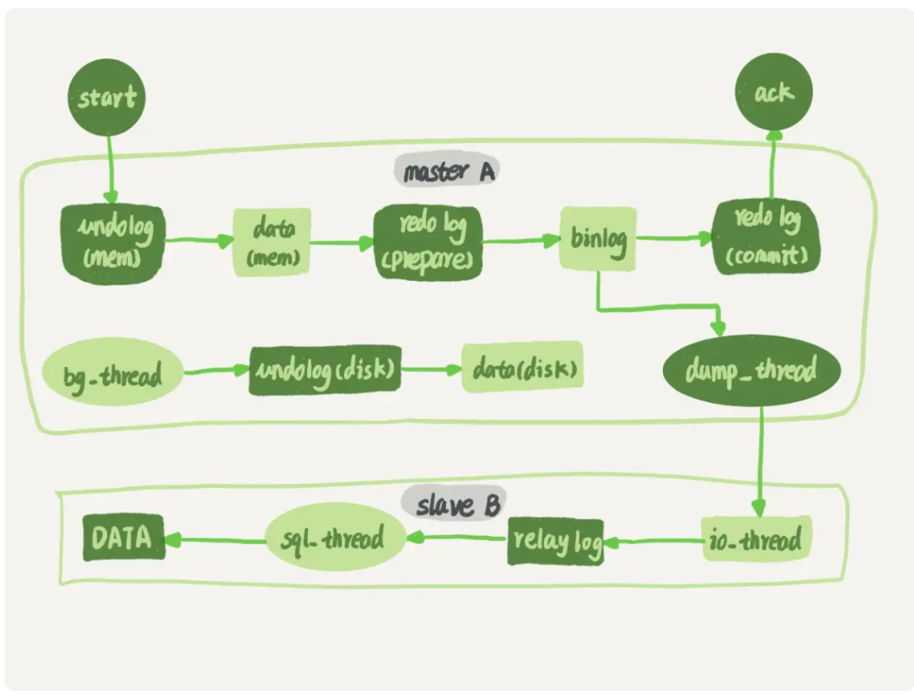
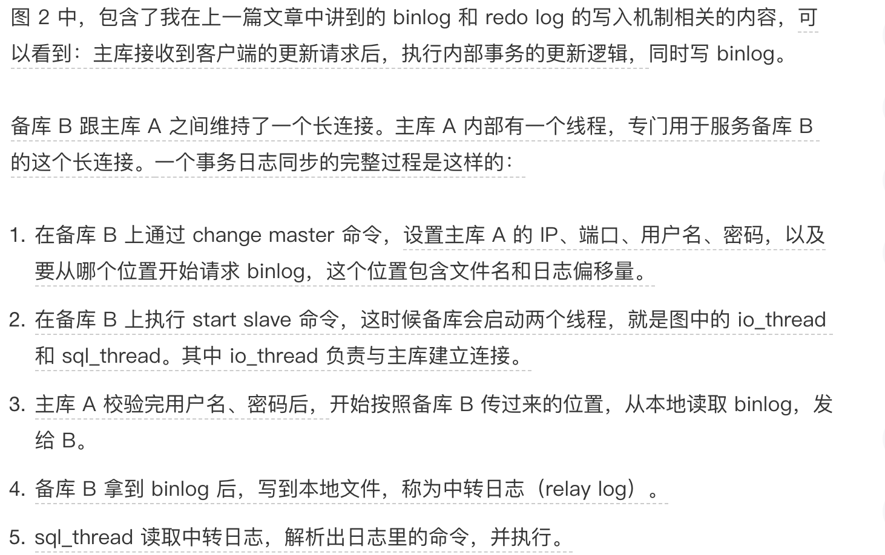
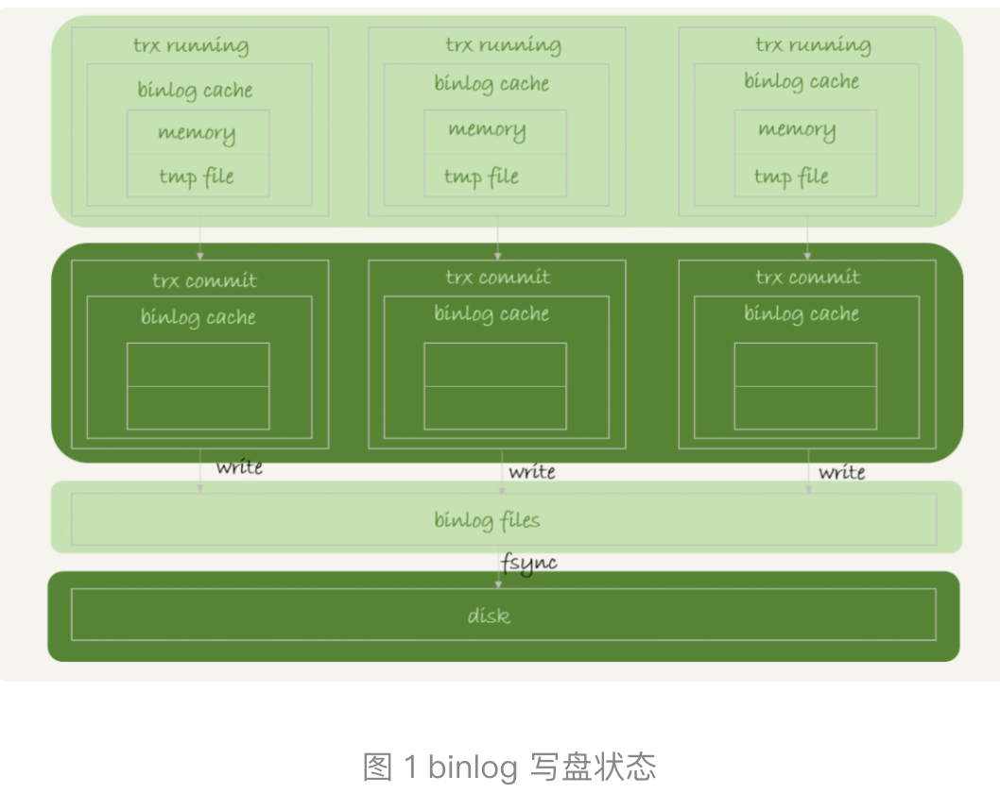
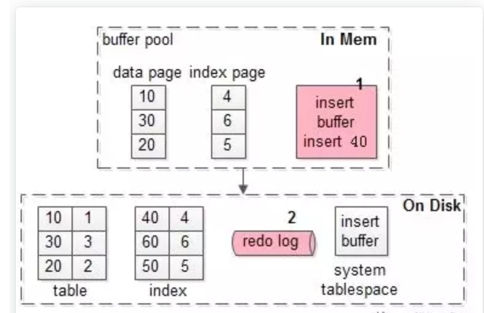
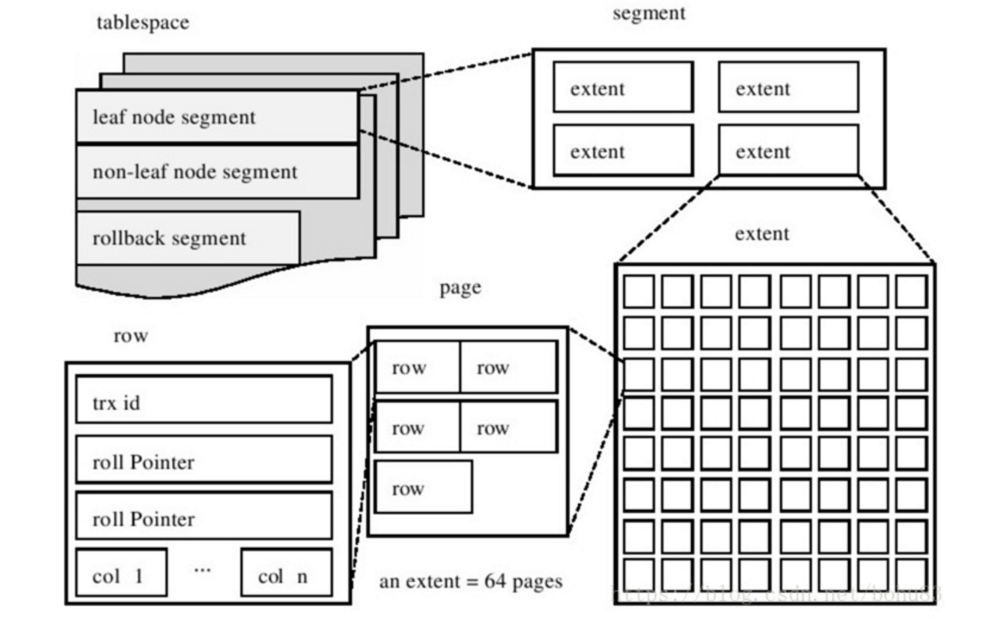

## 查询执行架构图





## explain

- https://dev.mysql.com/doc/refman/8.0/en/explain-output.html
- type

- Extra

> https://dev.mysql.com/doc/refman/8.0/en/explain-output.html#explain-extra-information
>
> **Using union** 索引合并(高性能mysql中第五章(194页))，需要优化，应该检查查询语句和表结构，也可以ignore index让优化器忽略某些索引
>
> **Using index** 覆盖索引
>
> **Using where** 通过where条件来筛选引擎返回的记录

- 修复或重建索引

> alter table test ENGINE=INNODB

## 优化

#### count

> count(*) 统计行数，同时会统计列为null的行，试验版本：5.7.21
>
> count(列) 统计列值的数量，不包含列值为NULL(会统计值为null的列，也就是区分大小写，试验版本：5.7.21)

#### 大表中删除很多行优化策略

```
//三步走
INSERT INTO t_copy SELECT * FROM t WHERE ... ;
RENAME TABLE t TO t_old, t_copy TO t;
DROP TABLE t_old;
```

## 主备

#### 主备同步





## 日志

#### slowlog

```
查看慢查询日志的参数
show variables like ‘%slow_query_log%’;
开启慢查询日志
set global slow_query_log=1;
查看慢查询阈值，单位：毫秒
show variables like ‘long_query_time%’;
设置慢查询阈值
set global log_query_time=0;
```

#### binlog(归档日志)

- 特性

> - “追加写”是指 binlog 文件写到一定大小后会切换到下一个，并不会覆盖以前的日志
> - binlog 是 MySQL 的 Server 层实现的，所有引擎都可以使用
> - binlog 是逻辑日志，记录的是这个语句的原始逻辑，比如“给 ID=2 这一行的 c 字段加 1 ”

- 模式

> statement 格式的话是记sql语句
>
> row格式会记录行的内容,记两条，更新前和更新后都有
>
> mixed上两种的混合使用，MySQL 自己会判断这条 SQL 语句是否可能引起主备不一致，如果有可能，就用 row 格式，否则就用 statement 格式

  极客23课

#### redolog(重做日志)

- redolog流程

> 一条记录更新时，innoDB引擎先把记录写到redo log中，并同时更新到内存中，这样更新就算完成。innoDB会在适当(系统空闲时)的时候将这个操作记录更新到磁盘。

- redolog特性

> - 固定大小,空间会使用完
> - redo log 是物理日志，记录的是“在某个数据页上做了什么修改”
> - redo log环形，边写边记录边记录
> - redolog配置的一组文件，通过wite pos(当前记录的位置)和check point(当前擦除的记录或上次刷盘的位置)指针同步数据。

- innoDB特有的log

#### binlog&redolog联系


## 事务

- 开启事务建议和优化

> autocommit 为1的情况下 begin 开启事物 commit 提交事物 commit work and chain 提交事物并开启下一个事物，减少begin的开销。正常情况不需要commit work and chain
>
> 例如：
>
> autocommit=1的前提下。使用如下的步骤手动的开启事务。 begin; update ...; commit work and chain; update ...; commit work and chain; update ...; rollback;
>
> **begin/start transaction** 命令并不是一个事务的起点，在执行到它们之后的第一个操作 InnoDB 表的语句，事务才真正启动。如果你想要马上启动一个事务，可以使用 **start transaction with consistent snapshot** 这个命令

- 事务

```
查找持续时间超过 60s 的事务（查找长事务）
select * from information_schema.innodb_trx where TIME_TO_SEC(timediff(now(),trx_started))>60


```

## 锁

#### 全局锁

> ```
> 全库只读
> flush tables with read lock
> 全库只读
> set global readonly=true
> ```
>
> 既然要全库只读，为什么不使用 set global readonly=true 的方式呢？
>
> - readonly 有些系统会用来判断主库或备库
> - 客户端异常中断，ftwrl会自动释放全局锁。readonly不会自动释放，这样会导致整个库长时间处于不可写状态，风险较高

#### 表级锁

> 表级锁两种：表锁和元数据锁(MDL)

- 表锁

> ```
> 表锁
> lock tables ... read/write
> 解锁
> unlock tables
> ```

- MDL（metadata lock)锁(server层逻辑)

> MDL 不需要显式使用，在访问一个表的时候会被自动加上。
>
> 在 MySQL 5.5 版本中引入了 MDL，当对一个表做增删改查操作的时候，加 MDL 读锁；当要对表做结构变更操作的时候，加 MDL 写锁

- 行锁

> 在 InnoDB 事务中，行锁是在需要的时候才加上的，但并不是不需要了就立刻释放，而是要等到事务结束时才释放。这个就是两阶段锁协议

> **死锁处理**
>
> 1. 直接进入等待，直到超时。这个超时时间可以通过参数 innodb_lock_wait_timeout 来设置
> 2. 发起死锁检测，发现死锁后，主动回滚死锁链条中的某一个事务，让其他事务得以继续执行。将参数 innodb_deadlock_detect 设置为 on，表示开启这个逻辑

#### 行锁

> 共享锁 (lock in share mode)：只锁覆盖索引、排他锁 (for update)：会顺便给主键索引加锁 
>
> **枷锁原则：**
>
> 原则 1：加锁的基本单位是 next-key lock。希望你还记得，next-key lock 是前开后闭区间。
>
> 原则 2：查找过程中访问到的对象才会加锁。
>
> 优化 1：索引上的等值查询，给唯一索引加锁的时候，next-key lock 退化为行锁。
>
> 优化 2：索引上的等值查询，向右遍历时且最后一个值不满足等值条件的时候，next-key lock 退化为间隙锁。
>
> 一个 bug：唯一索引上的范围查询会访问到不满足条件的第一个值为止。

## 索引

#### merge

> 将 change buffer 中的操作应用到原数据页，得到最新结果的过程称为 merge
>
> **触发merge**：访问数据页，执行changebuff的数据合并。系统有后台线程会定期 merge。在数据库正常关闭（shutdown）的过程中，也会执行 merge 操作
>
> 

#### 写缓存change buffer

> https://www.cnblogs.com/myseries/p/11307204.html
>
> **使用场景：**仅限普通索引，唯一和主键索引不能使用。写入数据后立刻查询也不适用



#### mysql选错索引处理

> 对于由于索引统计信息不准确导致的问题，你可以用 analyze table 来解决
>
> 而对于其他优化器误判的情况，你可以在应用端用 force index 来强行指定索引，也可以通过修改语句来引导优化器，还可以通过增加或者删除索引来绕过这个问题

#### 无法使用索引情况

> **函数操作了列：**
>
> select * from test where **month(yue)** = 2// 对索引字段做函数操作，可能会破坏索引值的有序性，因此优化器就决定放弃走树搜索功能
>
> select * from tradelog where id + 1 = 10000
>
> **隐式转换字段类型：**
>
> > select “10” > 9 的结果：
> >
> > 如果规则是“将字符串转成数字”，那么就是做数字比较，结果应该是 1；
> >
> > 如果规则是“将数字转成字符串”，那么就是做字符串比较，结果应该是 0。
>
>  select * from tradelog where tradeid=110717; //tradeid字段类型是varchar
>
> select * from tradelog where id="83126"; //不会导致全表扫描
>
> **字符集不同**

## 基本知识

#### DML&DDL

> DML：增删改查数据，select、update、insert、delete 
>
> DDL：修改表字段，create、alter、drop、truncate

#### online ddl

> 过程：
>
> 1. 拿MDL写锁
> 2. 降级成MDL读锁
> 3. 真正做DDL(create、alter、drop)
> 4. 升级成MDL写锁
> 5. 释放MDL锁

#### MVCC

> 多版本并发，主要通过undolog(回滚段)+read view实现
>
> MVCC是通过保存数据在某个时间点的快照来实现的，即不管需要执行多久，每个事务看到的数据都是一致的。InnoDB的MVCC是通过在每行数据后面保存<font color=#ff6600;>两个隐藏的列</font>，一个列保存行的创建时间，一个列保存行的过期时间(删除时间)。当然存储的不是时间值，而是系统的版本号。<font color=#ff6600;>每开始一个新事务，系统版本号自动递增(开始时刻的版本号作为事务的版本号，用来在查询到的每行记录的版本号比较)。MVCC仅仅对RR和RC隔离级别下有作用。</font>

#### 脏读幻读不可重复读

> 脏读：读到其他事务未提交的数据(读未提交)
> 不可重复读：前后读取的记录内容不一致(读未提交、读提交)
> 幻读：前后读取的记录数量不一致(读未提交、读提交、可重复读)，RR隔离级别处理幻读通过间隙锁

#### 脏页

> 当内存数据页跟磁盘数据页内容不一致的时候，我们称这个内存页为“脏页”
> 内存数据写入到磁盘后，内存和磁盘上的数据页的内容就一致了，称为“干净页”
> 平时很快的更新操作，都是在写内存和日志,他并不会马上同步到磁盘数据,这时内存数据页跟磁盘数据页内容不一致,我们称之为“脏页”
> 一条 SQL 语句，正常执行的时候特别快，偶尔很慢。那这时候可能就是在将脏页同步到磁盘中了

#### crash safe

> innoDB数据库发生异常宕机或断电，之前提交的记录都不会丢失，这个能力就叫crash safe,主要通过redolog保证数据不丢失。（mysql 进程异常重启了，系统会自动去检查redo log，将未写入到Mysql的数据从redo log恢复到Mysql中去。事务在提交写入磁盘前，会先写到redo log里面去）

#### mysql存储单位

> 段（Segment）由一个或多个区组成，区在文件系统是一个**连续分配**的空间
>
> 区在 InnoDB 存储引擎中，一个区会分配 64 个连续的页
>
> 页是InnoDB存储引擎磁盘管理的最小单位，每个页默认16KB




#### WAL(Write-Ahead Logging)

wal主要作用，先写日志(redo log日志)，再写(等系统空闲会更新到)磁盘。这里写日志也是磁盘，只是redo log把随机IO改写顺序IO(随机IO相比顺序IO有一个寻址的过程，所以顺序写盘更快)。

## 存储过程脚本

```
delimiter ;;
create procedure idata()
begin
  declare i int;
  set i=1;
  while(i<=100000)do
    insert into t values(i, i, i);
    set i=i+1;
  end while;
end;;
delimiter ;
call idata();
```

#### flush&purge&merge

> flush 一般是说刷脏页，
> purge一般是指清undo log,
> merge一般是指应用change buffer

## 文章推荐

> http://mysql.taobao.org/monthly/2015/04/01/
> https://www.aneasystone.com/archives/2017/11/solving-dead-locks-two.html


MySql核心基础知识

## 知识点

```
DML 增删改查
DDL alter 表结构
```

## Mysql逻辑架构


## 隔离级别

## 锁

- ***InnoDB加锁SQL***
```
SELECT......LOCK IN SHARE MODE
SELECT......FOR UPDATE
```

- **全局锁**

```
flush tables with read lock; (FTWRL) //数据库加读锁 数据库仅能读，如果是从库，也不能执行主库同步过来的binlog。unlock talbes释放锁
set gloabl readonley=true //全库只读
```

- **表级锁**

    - 表锁

    ```
    lock tables ... read/write 加锁,
    unlock tables 解锁
    ```

    - 元数据锁(MDL锁自动添加)

    ```
    在 MySQL 5.5 版本中引入了 MDL，当对一个表做增删改查操作的时候，加 MDL 读锁；当要对表做结构变更操作的时候，加 MDL 写锁
    ```

- 行锁

```
在 InnoDB 事务中，行锁是在需要的时候才加上的，但并不是不需要了就立刻释放，而是要等到事务结束时才释放。这个就是两阶段锁协议。
```

#### 优秀解答

- 段锁协议主要的思想是：对锁的操作应该分为两个阶段，膨胀阶段和收缩阶段——在膨胀阶段，你只能获取锁，禁止释放锁。在收缩阶段，你只能释放锁，禁止获取锁。
    显然，如果行锁用完立即释放，就走完了一个膨胀-收缩。之后再获取锁就破坏了这个规定——你不能在收缩阶段获取锁。因此，“在事务结束前不释放锁，让锁在事务结束的时候才收缩释放”就成了达成两阶段锁协议的方式。

- 死锁
    1. 一种策略是，直接进入等待，直到超时。这个超时时间可以通过参数 innodb_lock_wait_timeout 来设置。
    2. 另一种策略是，发起死锁检测，发现死锁后，主动回滚死锁链条中的某一个事务，让其他事务得以继续执行。将参数 innodb_deadlock_detect 设置为 on，表示开启这个逻辑。(推荐)


## 多版本并发控制(MVCC)

MVCC是通过保存数据在某个时间点的快照来实现的，即不管需要执行多久，每个事务看到的数据都是一致的。InnoDB的MVCC是通过在每行数据后面保存<font color=#ff6600;>两个隐藏的列</font>，一个列保存行的创建时间，一个列保存行的过期时间(删除时间)。当然存储的不是时间值，而是系统的版本号。<font color=#ff6600;>每开始一个新事务，系统版本号自动递增(开始时刻的版本号作为事务的版本号，用来在查询到的每行记录的版本号比较)。MVCC仅仅对RR和RC隔离级别下有作用。</font>

## binlog(mysql server层自己的log)

**查看慢查询是否开启** show variables like 'slow_query_log'(%_query_%)

bin log追加写入

#### binlog模式

- statement 格式的话是记sql语句
- row格式会记录行的内容，记两条，更新前和更新后都有

## redo log(InnoDBd引擎特有)

redo log循环写入，InnoDB的redo log是固定大小。

一条更新，InnoDB会先把记录写到redo log,并更新内存(buffer bool)，这条更新就完成了，InnoDB会在适当时将这个操作记录到磁盘

## redo log 和binlog

redo和binlog在InnoDB中执行update操作时的大致流程：

- 执行器先找引擎取 ID=2 这一行。ID 是主键，引擎直接用树搜索找到这一行。如果 ID=2 这一行所在的数据页(数据小单位:页)本来就在内存(buffer bool)中，就直接返回给执行器；否则，需要先从磁盘读入内存，然后再返回。
- 执行器拿到引擎给的行数据，把这个值加上 1，比如原来是 N，现在就是 N+1，得到新的一行数据，再调用引擎接口写入这行新数据。
- 引擎将这行新数据更新到内存中，同时将这个更新操作记录到 redo log 里面，此时 <font color=#ff6600;>redo log 处于 prepare </font>状态。然后告知执行器执行完成了，随时可以提交事务。
- 执行器生成这个操作的<font color=#ff6600;> binlog</font>，并把 binlog 写入磁盘。
- 执行器调用引擎的提交事务接口，引擎把刚刚写入的 redo log 改成提交（commit）状态，更新完成。

## undo log

## undo和redo

- 更新记录redolog，回滚记录undolog

#### 优秀解答

- 第一、redo log是一个特定的区域，写入操作是顺序写，非常快，而将数据刷新到磁盘是随机io，比较慢，所以要先写入redo log。 第二、update操作是要把数据查询到buffer_pool(非唯一索引可以不用先查询，可以先把要改动的操作存在change_buffer中，然后等空闲的时候或者其他操作再merge)，查询出来之后，这一页数据就在buffer_pool中，MySQL会先把buffer_pool里面的这页数据更新到最新同时写redo log，然后就更新结束了，此时在bufferpool里面的页就是脏页，后续会刷新到磁盘中。
- change buffer只是对写入、删除(非唯一)二级索引起作用。更新内存的意思是先要把这一行记录从磁盘加载到内存中(buffer_pool),然后在内存中更新这个值。不会立即把最新值刷新到磁盘

## WAL(Write-Ahead Logging)

wal主要作用，先写日志(redo log日志)，再写(等系统空闲会更新到)磁盘。这里写日志也是磁盘，只是redo log把随机IO改写顺序IO(随机IO相比顺序IO有一个寻址的过程，所以顺序写盘更快)。

## 索引

> 引申三种数据结构
>
> - 哈希表：适合等值查询，由于不是有序，不适合范围查询
> - 有序数组 适合等值和范围查询 针对插入和删除需要移动后面的记录 代价高
> - 二叉搜索树 父节点val大于左子树 右子树大于父节点

#### b+树

**mysql存储结构(单位：表>段>区>页>行)**

存储空间基本单位为页，一个页就是一棵树B+树的节点，数据库I/O操作的最小单位是页，与数据库相关的内容都会存储在页的结构里。同一层的**节点**之间，通过页的结构构成了一个**双向链表**。非叶子节点，包括了多个索引行，每个索引行里存储索引键和指向下一层页面的指针。叶子节点为存储了关键字和行记录，在节点内部(也就是页结构的内部)记录之间是一个单向的表

#### 索引相关sql

```
//强制使用索引 force index(a)
select * from t force index(a) where a=1
```


## 常用SQL

#### SHOW命令

SHOW STATUS 服务器统计计数器

SHOW PROCESSLIST 显示用户正在运行的线程

#### 索引

- 给字符串字段加前缀索引(使用前缀索引就不能使用覆盖索引了)

```
//第一种
//这种方式适合后期有一定量时候用，数据是随时变化的，区分度可以过段时间更新
1 计算列有多少不同值：select count(distinct email) as L from SUser;
2 寻找区分度，区分度越大越好
  select 
    count(distinct left(email,4)）as L4,
    count(distinct left(email,5)）as L5,
    count(distinct left(email,6)）as L6,
    count(distinct left(email,7)）as L7,
  from SUser;
3 设定损失比例，比如业务接受最多损失5%,然后找出大于L*95%的值。

//第二种
如果符合一定的数字规律可以把值倒序排列，比如身份证。
//第三种
crc32(email)生成新的字段，在该字段上建立索引
```


#### db优化sql

>  analyze table t 重新统计索引信息
>
> show index from t 查看表索引计数

#### 引擎

- 修改引擎

```
//第一种
//适用于任何存储引擎，但是执行时间长,mysql会按行将数据从原表复制到一张新表中，在复制期间会消耗更多的IO，同时原表会加读锁
ALTER TABLE mytable ENGINE = InnoDB

//第二种
利用mysqldump工具导入导出

//第三种 
//新建一张表，然后 利用INSERT...SELECT,数据量不大这种方式不错，如果数据量比较大，就需要分批执行。
1 CREATE TABLE new_table LIKE old_table
2 ALTER TABLE new_table ENGINE = InnoDB
3 INSERT INTO new_table SELECT * FROM old_talbe

//分批执行(注意要在事务内，原表加锁等问题)pt-online-schema-change工具更加方便执行如下流程
START TRANSACTION
INSERT INTO new_table SELECT * FROM old_table WHERE id BETWEEN x AND y;
COMMIT
```

## 优化

- explain

> rows 预计扫描行数，而不是实际的行数


