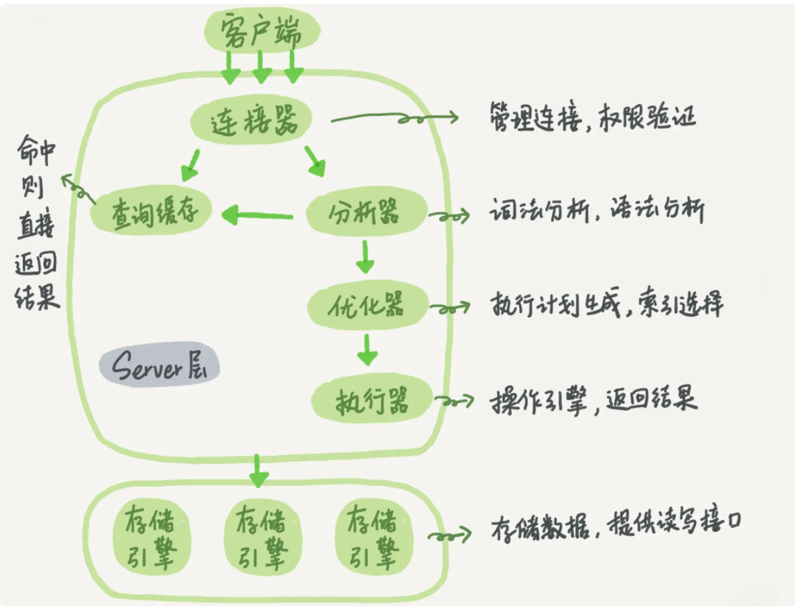

MySql核心基础知识

## 知识点

```
DML 增删改查
DDL alter 表结构
```

## Mysql逻辑架构



## 隔离级别

- ***READ UNCOMMITTED(未提交读)***
事务可以读取未提交的数据 (也被称为 <font color=#ff6600;>脏读</font>)。
- ***READ COMMITTED(读提交)***
一个事务从开始到提交之前，做的任何修改对其他事务均不可见。这个级别也被叫做<font color=#ff6600;>不可重复读</font>(前后读取的记录内容不一致)，因为两次执行同样的查询可能会得到不一样的结果（别人改数据的事务已经提交，我在我的事务中才能读到）。
- ***REPEATABLE READ(可重复读)***
解决了脏读问题，该级别保证在同一事务中多次读取同样数据结果是一致的。但是，可重复读无法解决幻读问题，<font color=#ff6600;>幻读</font>(记录数量不一致)指当某个事务(A事务)在读取某个范围内的数据时，另一个事务(B事务)在该范围内插入了新数据，当A事务再次读取改范围内的数据时，会产生幻行。InnoDB通过MVCC(主要通过间隙锁锁定行和索引中的间隙锁定)解决了幻读问题。
- ***SEARIALIZABLE(可串行化)***
最高的隔离级别，它通过强制事务串行化执行，避免幻读问题。它在读取每行数据时都会加锁，可能会导致大量超时和锁竞争。

## 锁

- ***InnoDB加锁SQL***
```
SELECT......LOCK IN SHARE MODE
SELECT......FOR UPDATE
```

- **全局锁**

```
flush tables with read lock; (FTWRL) //数据库加读锁 数据库仅能读，如果是从库，也不能执行主库同步过来的binlog。unlock talbes释放锁
set gloabl readonley=true //全库只读
```

- **表级锁**

    - 表锁

    ```
    lock tables ... read/write 加锁,
    unlock tables 解锁
    ```

    - 元数据锁(MDL锁自动添加)

    ```
    在 MySQL 5.5 版本中引入了 MDL，当对一个表做增删改查操作的时候，加 MDL 读锁；当要对表做结构变更操作的时候，加 MDL 写锁
    ```

- 行锁

```
在 InnoDB 事务中，行锁是在需要的时候才加上的，但并不是不需要了就立刻释放，而是要等到事务结束时才释放。这个就是两阶段锁协议。
```

#### 优秀解答

- 段锁协议主要的思想是：对锁的操作应该分为两个阶段，膨胀阶段和收缩阶段——在膨胀阶段，你只能获取锁，禁止释放锁。在收缩阶段，你只能释放锁，禁止获取锁。
    显然，如果行锁用完立即释放，就走完了一个膨胀-收缩。之后再获取锁就破坏了这个规定——你不能在收缩阶段获取锁。因此，“在事务结束前不释放锁，让锁在事务结束的时候才收缩释放”就成了达成两阶段锁协议的方式。

- 死锁
    1. 一种策略是，直接进入等待，直到超时。这个超时时间可以通过参数 innodb_lock_wait_timeout 来设置。
    2. 另一种策略是，发起死锁检测，发现死锁后，主动回滚死锁链条中的某一个事务，让其他事务得以继续执行。将参数 innodb_deadlock_detect 设置为 on，表示开启这个逻辑。(推荐)


## 多版本并发控制(MVCC)

MVCC是通过保存数据在某个时间点的快照来实现的，即不管需要执行多久，每个事务看到的数据都是一致的。InnoDB的MVCC是通过在每行数据后面保存<font color=#ff6600;>两个隐藏的列</font>，一个列保存行的创建时间，一个列保存行的过期时间(删除时间)。当然存储的不是时间值，而是系统的版本号。<font color=#ff6600;>每开始一个新事务，系统版本号自动递增(开始时刻的版本号作为事务的版本号，用来在查询到的每行记录的版本号比较)。MVCC仅仅对RR和RC隔离级别下有作用。</font>

## binlog(mysql server层自己的log)

**查看慢查询是否开启** show variables like 'slow_query_log'(%_query_%)

bin log追加写入

#### binlog模式

- statement 格式的话是记sql语句
- row格式会记录行的内容，记两条，更新前和更新后都有

## redo log(InnoDBd引擎特有)

redo log循环写入，InnoDB的redo log是固定大小。

一条更新，InnoDB会先把记录写到redo log,并更新内存(buffer bool)，这条更新就完成了，InnoDB会在适当时将这个操作记录到磁盘

## redo log 和binlog

redo和binlog在InnoDB中执行update操作时的大致流程：

- 执行器先找引擎取 ID=2 这一行。ID 是主键，引擎直接用树搜索找到这一行。如果 ID=2 这一行所在的数据页(数据小单位:页)本来就在内存(buffer bool)中，就直接返回给执行器；否则，需要先从磁盘读入内存，然后再返回。
- 执行器拿到引擎给的行数据，把这个值加上 1，比如原来是 N，现在就是 N+1，得到新的一行数据，再调用引擎接口写入这行新数据。
- 引擎将这行新数据更新到内存中，同时将这个更新操作记录到 redo log 里面，此时 <font color=#ff6600;>redo log 处于 prepare </font>状态。然后告知执行器执行完成了，随时可以提交事务。
- 执行器生成这个操作的<font color=#ff6600;> binlog</font>，并把 binlog 写入磁盘。
- 执行器调用引擎的提交事务接口，引擎把刚刚写入的 redo log 改成提交（commit）状态，更新完成。

## undo log

## undo和redo

- 更新记录redolog，回滚记录undolog

#### 优秀解答

- 第一、redo log是一个特定的区域，写入操作是顺序写，非常快，而将数据刷新到磁盘是随机io，比较慢，所以要先写入redo log。 第二、update操作是要把数据查询到buffer_pool(非唯一索引可以不用先查询，可以先把要改动的操作存在change_buffer中，然后等空闲的时候或者其他操作再merge)，查询出来之后，这一页数据就在buffer_pool中，MySQL会先把buffer_pool里面的这页数据更新到最新同时写redo log，然后就更新结束了，此时在bufferpool里面的页就是脏页，后续会刷新到磁盘中。
- change buffer只是对写入、删除(非唯一)二级索引起作用。更新内存的意思是先要把这一行记录从磁盘加载到内存中(buffer_pool),然后在内存中更新这个值。不会立即把最新值刷新到磁盘

## WAL(Write-Ahead Logging)

wal主要作用，先写日志(redo log日志)，再写(等系统空闲会更新到)磁盘。这里写日志也是磁盘，只是redo log把随机IO改写顺序IO(随机IO相比顺序IO有一个寻址的过程，所以顺序写盘更快)。

## 索引

> 引申三种数据结构
>
> - 哈希表：适合等值查询，由于不是有序，不适合范围查询
> - 有序数组 适合等值和范围查询 针对插入和删除需要移动后面的记录 代价高
> - 二叉搜索树 父节点val大于左子树 右子树大于父节点

#### b+树

**mysql存储结构(单位：表>段>区>页>行)**

存储空间基本单位为页，一个页就是一棵树B+树的节点，数据库I/O操作的最小单位是页，与数据库相关的内容都会存储在页的结构里。同一层的**节点**之间，通过页的结构构成了一个**双向链表**。非叶子节点，包括了多个索引行，每个索引行里存储索引键和指向下一层页面的指针。叶子节点为存储了关键字和行记录，在节点内部(也就是页结构的内部)记录之间是一个单向的表

#### 索引相关sql

```
//强制使用索引 force index(a)
select * from t force index(a) where a=1
```


## 常用SQL

#### SHOW命令

SHOW STATUS 服务器统计计数器

SHOW PROCESSLIST 显示用户正在运行的线程

#### 索引

- 给字符串字段加前缀索引(使用前缀索引就不能使用覆盖索引了)

```
//第一种
//这种方式适合后期有一定量时候用，数据是随时变化的，区分度可以过段时间更新
1 计算列有多少不同值：select count(distinct email) as L from SUser;
2 寻找区分度，区分度越大越好
  select 
    count(distinct left(email,4)）as L4,
    count(distinct left(email,5)）as L5,
    count(distinct left(email,6)）as L6,
    count(distinct left(email,7)）as L7,
  from SUser;
3 设定损失比例，比如业务接受最多损失5%,然后找出大于L*95%的值。

//第二种
如果符合一定的数字规律可以把值倒序排列，比如身份证。
//第三种
crc32(email)生成新的字段，在该字段上建立索引
```


- 重建索引命令

    ```
    //重建非主键索引
    alter table T drop index k;
    alter table T add index(k);
    
    //重建主键索引
    //重建主键索引会影响非主键索引(其他索引叶子节点存储为主键索引ID)，在操作时候要在业务低估时
    //alter table T drop primary key;
    //alter table T add primary key(id);
    alter table T engine=InnoDB
    
    //重新统计索引信息
    analyze table t
    ```

#### db优化sql

>  analyze table t 重新统计索引信息
>
> show index from t 查看表索引计数

#### 引擎

- 修改引擎

```
//第一种
//适用于任何存储引擎，但是执行时间长,mysql会按行将数据从原表复制到一张新表中，在复制期间会消耗更多的IO，同时原表会加读锁
ALTER TABLE mytable ENGINE = InnoDB

//第二种
利用mysqldump工具导入导出

//第三种 
//新建一张表，然后 利用INSERT...SELECT,数据量不大这种方式不错，如果数据量比较大，就需要分批执行。
1 CREATE TABLE new_table LIKE old_table
2 ALTER TABLE new_table ENGINE = InnoDB
3 INSERT INTO new_table SELECT * FROM old_talbe

//分批执行(注意要在事务内，原表加锁等问题)pt-online-schema-change工具更加方便执行如下流程
START TRANSACTION
INSERT INTO new_table SELECT * FROM old_table WHERE id BETWEEN x AND y;
COMMIT
```

## 优化

- explain

> rows 预计扫描行数，而不是实际的行数

## TIPS

- **禁止**同一个事务使用不同的存储引擎。

- > flush 一般是说刷脏页，
    > purge一般是指清undo log,
    > merge一般是指应用change buffer

