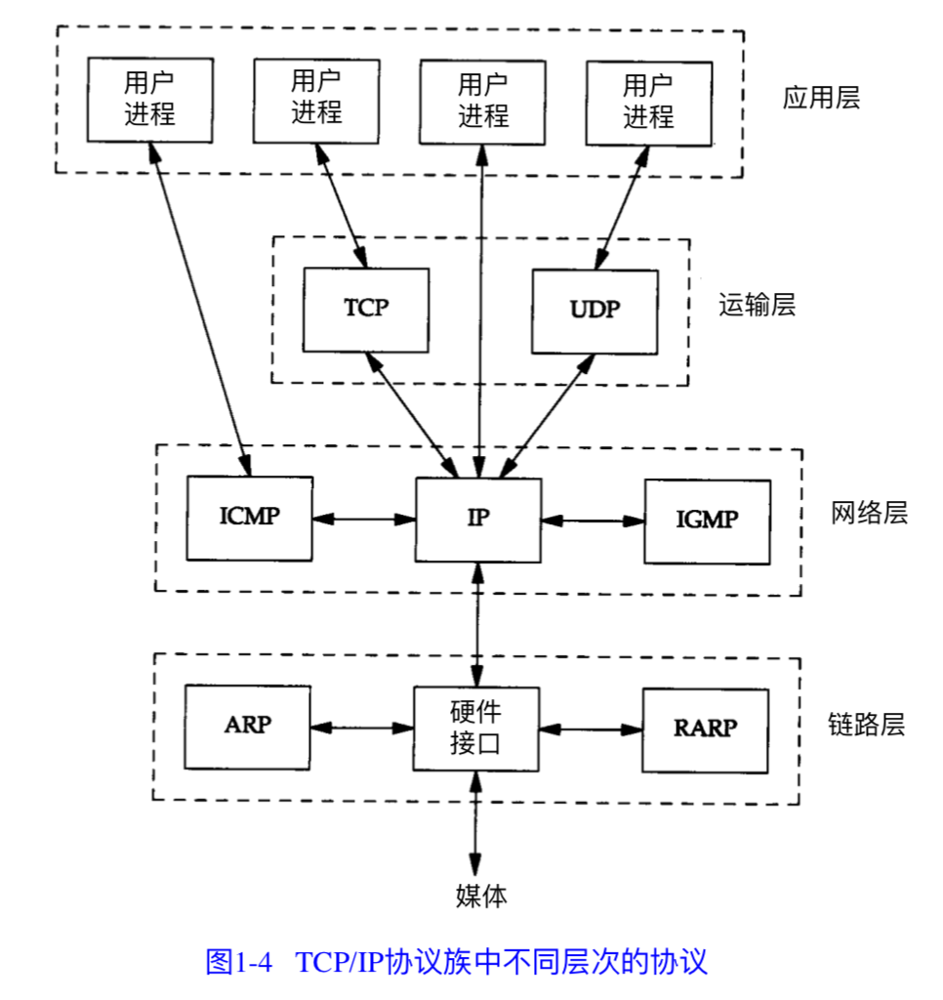
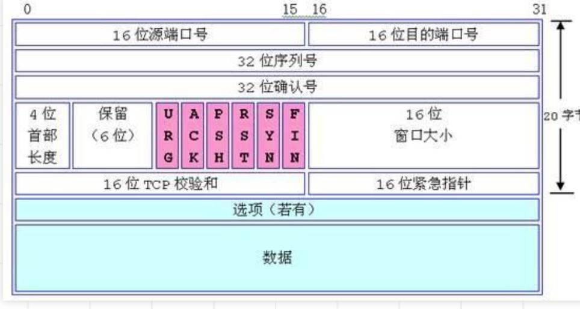
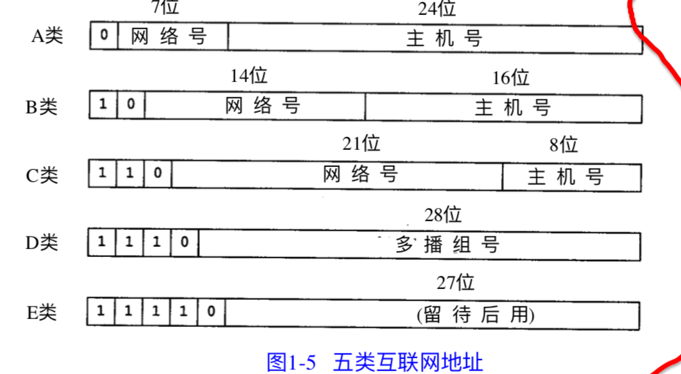
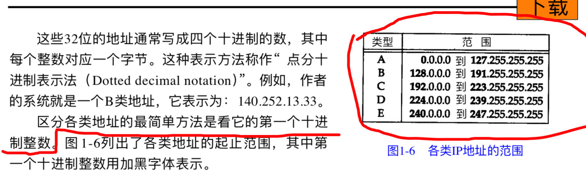
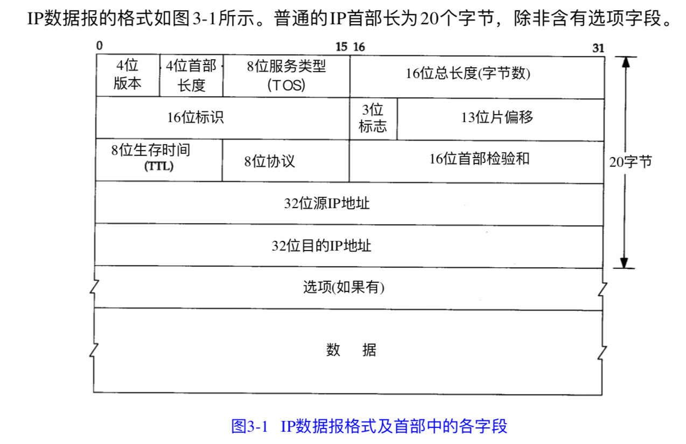
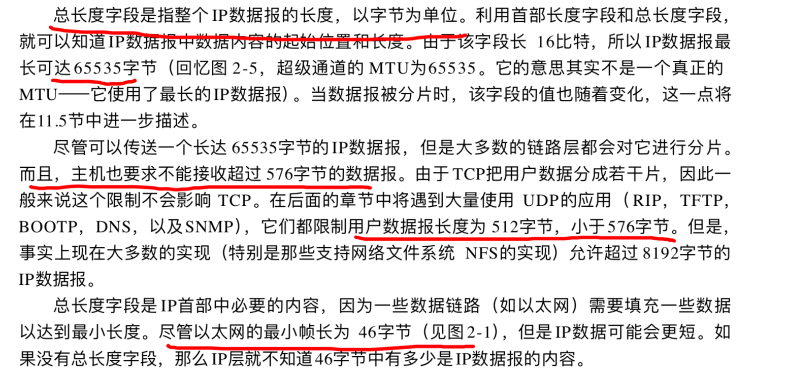
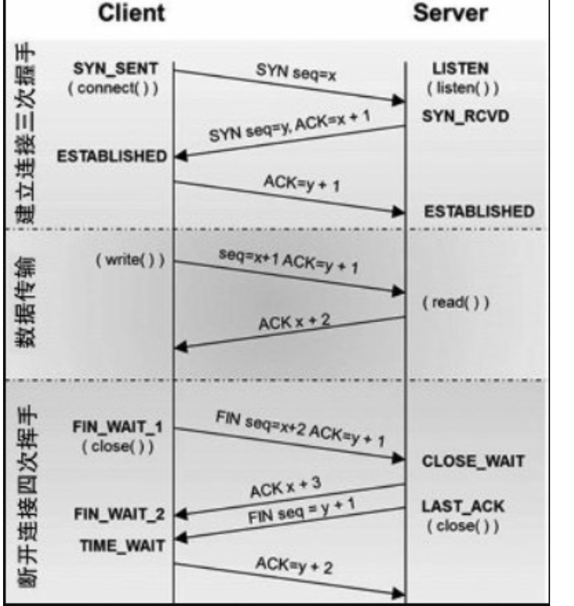
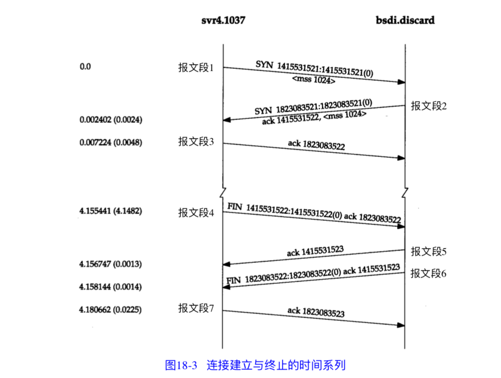
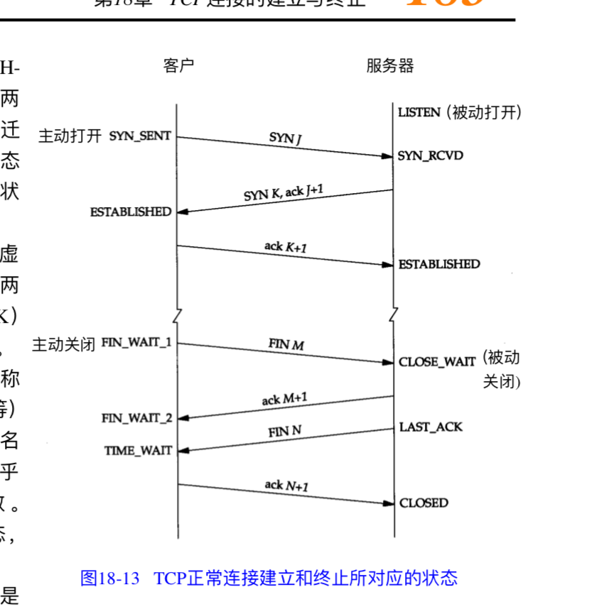

#### 定义解释

- tcp传递给ip数据单元称为：报文段或TCP段
- ip传递给网络接口层称为：ip数据包

> ip的总字段长度为16位，所以ip数据包最长可达**65535**字节

- 通过以太网传输的比特流称为：帧

#### tcpip分层



#### tcp报文头



- tcp状态表示

> ```
> SYN(建立联机) 
> ACK(确认) 
> PSH(传送) 
> FIN(结束) 
> RST(重置) 
> URG(紧急)
> ```

#### ip知识

- ip分类





- ip数据格式





#### 三次握手

#### 四次挥手

- time_wait是主动发起fin一方在回复完对方的回首后的一个状态，这个状态标准时间是4分钟，4分钟后进入closed

> 4分钟等于2MSL，每个MSL是2分钟
>
> 如果服务频繁主动关闭套接字，就会产生大量timewait，这时可以设置timewait调整到30s-60s







